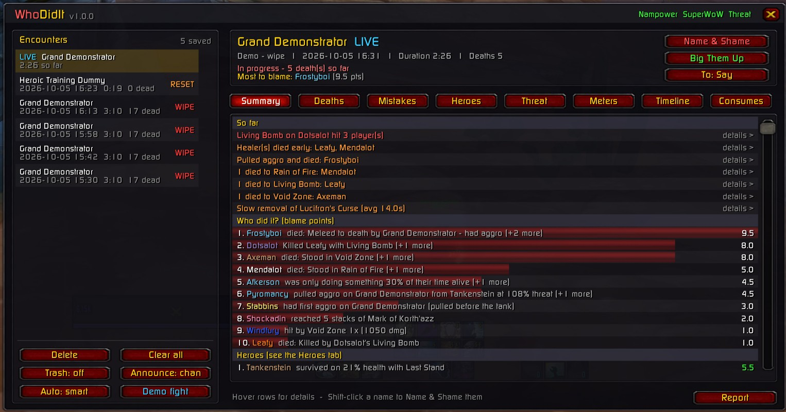
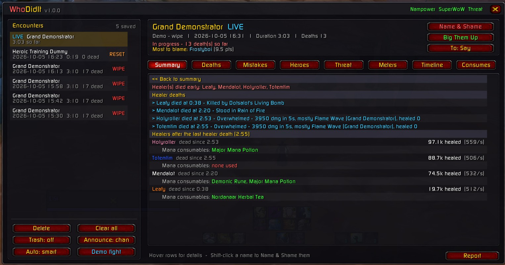
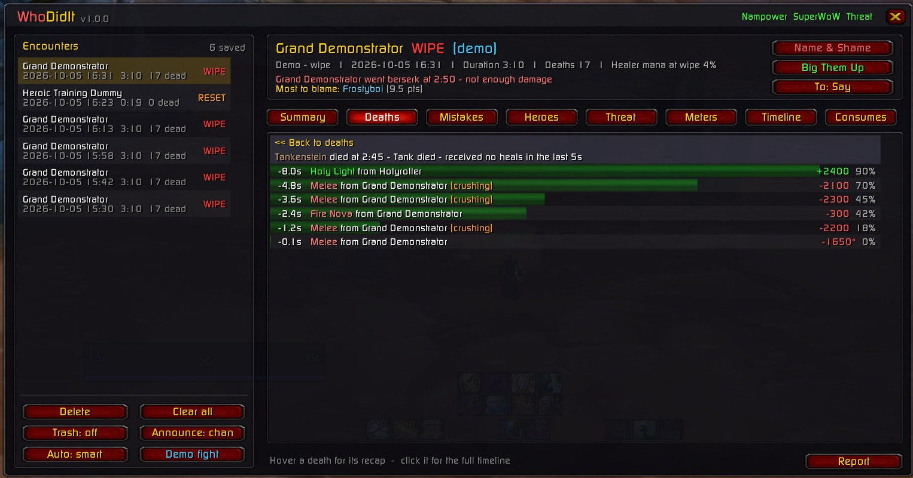
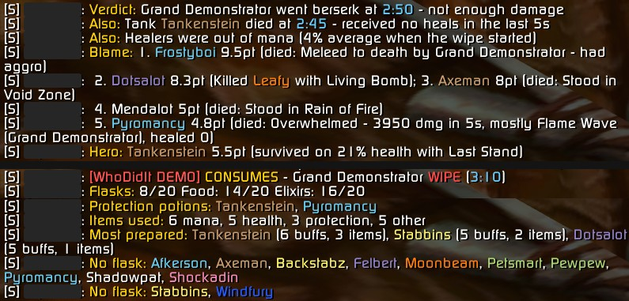

<div align="center">

# WhoDidIt

**Raid wipe & death analyser for World of Warcraft 1.12**
<br>OctoWoW · Turtle WoW · vanilla

Records every boss fight, then tells you **why** the raid wiped and **who** did it.


<sub>Type <code>/wdi</code> in game · click <b>Demo fight</b> to try every feature without raiding</sub>

</div>

---

## Highlights

- 🔍 **Why did it go wrong?** A ranked list of wipe causes: tank deaths, healers out of mana, enrage timers, mechanics, aggro pulls, missed interrupts. Click any cause for the full breakdown: who healed the tank in their last 5 seconds, or each healer's mana and potions.
- ☠️ **Death recaps.** The last 15 seconds before every death (hits, heals, debuffs, items, health %), with the cause worked out for you.
- 🎯 **Aggro & threat.** Every time the boss switched target, with the server's threat % at that moment. Non-tanks who rip aggro get blamed.
- 📋 **Blame board.** Points for standing in fire, pulling aggro, bombing the raid, idling and low DPS, with a "Most to blame" verdict.
- 🦸 **Heroes.** Game-saving plays: clutch heals, shields that ate a killing blow, taunt rescues, Blessing of Protection, battle res, Innervate, dispelled mind control.
- 🧪 **Consumes.** Every player's flask, elixirs, food, juju and protection potions, plus every potion, rune, tea and healthstone they used. A **slacker check** says who's missing what their role needs, at every pull and every ready check.
- 🎒 **Auto master looting.** Greys, whites and greens (and raid mats) handed out by themselves to you or anyone you pick, with a backup for when your bags are full.
- 📣 **Shout-outs.** *Name & Shame* and *Big Them Up* awards, reports and per-player posts, sent to any channel in colour.
- 📊 **Meters & timeline.** Damage, healing, taken, activity and utility, plus a full timeline of the fight.
- 💀 **Auto marking.** Marks whole packs in one go, with ~365 raid packs built in, smart marks for tricky fights, and quick save for your own packs.
- 💰 **Master looting.** RollFor is built in, with an **SR MasterLoot** tab: soft-res import and check, rolls, awards, loot given, and a step-by-step guide.
- 🏆 **Rankings & Chronicle.** Kill and clear times against every guild on your realm, and the Chronicle combat logger built in.

## Screenshots

<table>
  <tr>
    <td width="50%"><br><b>Live view.</b> The report builds itself while you fight.</td>
    <td width="50%"><br><b>Cause breakdown.</b> Click any cause. Here: which healers died and when, and each survivor's healing and mana consumables.</td>
  </tr>
  <tr>
    <td width="50%"><br><b>Deaths.</b> Every death with its cause and killing blow. Deaths after the wipe point are greyed out.</td>
    <td width="50%"><br><b>Death recap.</b> Click a death for its last seconds: every hit, heal and crushing blow, with a health bar.</td>
  </tr>
  <tr>
    <td width="50%"><br><b>Mistakes.</b> Every mistake with its time and blame points, worst first.</td>
    <td width="50%"><br><b>Threat.</b> Who the boss attacked and why (tank swap, pulled aggro, opened early), plus peak threat per player.</td>
  </tr>
  <tr>
    <td width="50%"><br><b>Meters.</b> Damage, healing, taken, activity and utility, with roles marked.</td>
    <td width="50%"><br><b>Timeline.</b> Everything that happened in the fight, in order.</td>
  </tr>
  <tr>
    <td width="50%"><br><b>Consumes.</b> Flask / food overview, then each player's buffs and items used, colour-coded by type.</td>
    <td width="50%"><br><b>Coloured chat posts.</b> A Report and a Consumes post: names in class colour, times in blue, numbers in white. Long lines split instead of losing their colours.</td>
  </tr>
</table>

## Install

1. Download the [latest code](https://github.com/bdot89/WhoDidIt/archive/refs/heads/main.zip) (or `git clone`).
2. Extract it into `Interface/AddOns/` and **rename the folder to `WhoDidIt`**. GitHub names it `WhoDidIt-main`, and the game won't load it under that name.
3. Make sure **Nampower** and **SuperWoW** are installed (see below), then log in and type `/wdi`.
4. *Optional:* double-click `tools\WhoDidIt-Sync.cmd` once. It installs the built-in [Chronicle logger](#chronicle-logs), [RollFor](#master-looting-rollfor) and the [auto marker's packs](#auto-marking), and pulls every guild's times for [Rankings](#rankings). Then restart WoW.

### Requirements

| Mod | What WhoDidIt uses it for |
| --- | --- |
| **Nampower** (dll) | Damage, healing, swings, buffs/debuffs, deaths and consumables. Without it, only deaths are tracked. |
| **SuperWoW** (dll) | Player and mob names from GUIDs, who the boss is targeting, cast events (interrupts, activity, tranqs, saves). |
| TWThreat (addon, optional) | If it's loaded, WhoDidIt reads the same server threat packets. If not, WhoDidIt asks the server itself (`/wdi threat off` to stop). |

WhoDidIt switches on the Nampower CVars it needs (`NP_EnableAutoAttackEvents`, `NP_EnableSpellHealEvents`, `NP_EnableSpellGoEvents`).

## Quick start

1. Type **`/wdi`** and click **Demo fight** (bottom-left). Two sample fights load, a messy wipe and a cleaner kill, and every tab has something to show. **Shift-click** it to watch the wipe play out live at 4× speed.
2. Mark your main tanks: **`/wdi tank <name>`**, or right-click a name in the window. Tanks are auto-detected, but setting them makes aggro blame much more accurate.
3. Pick where posts go with the **Post to** button (bottom left, the same on every tab): Raid, Raid Warning, Party, Guild, Officer, Say, Yell, Only me, or a custom channel (`/wdi channel <name>`).
4. Raid. Fights are recorded automatically when your group engages a boss. **Keep the boss targeted** so threat % gets recorded.

## The window

| Tab | What it shows |
| --- | --- |
| **Summary** | The verdict, the ranked wipe causes (click for details), the blame board, the top heroes and raid notes (missing buffs, boss debuff uptime) |
| **Deaths** | Every death with its cause. Hover for the recap, click for the second-by-second timeline with health bars |
| **Mistakes** | The blame board (with bars), then every mistake with its time, type and points, laid out like Heroes. Click a mistake to post it (Ctrl-click previews). **Post mistakes** / **Name & Shame** buttons |
| **Heroes** | The hero board (with bars), then every game-saving moment with its time, type and points. Click a moment to post it (Ctrl-click previews). **Post heroes** / **Big Them Up** buttons |
| **Threat** | Boss target changes with threat % and a verdict, plus peak threat per player |
| **Meters** | Damage, Healing, Taken, Activity, Utility (interrupts, dispels, tranqs, items) |
| **Timeline** | Everything that happened, in order |
| **Consumes** | Raid flask/food overview and the **slacker check** (who's missing what their role needs), then each player's buffs, items used and what they were missing. **Post summary / missing / everyone** and **Check raid now** buttons |

### Clicking names

Every player name in the window (blame board, Heroes, Meters, Consumes) works the same way:

| Click | Does |
| --- | --- |
| **Click** | Post that player's overview for the current tab (blame, hero plays, stats or consumes) to your channel |
| **Ctrl-click** | Preview that post in your own chat only |
| **Shift-click** | Name & Shame just them |
| **Alt-click** | Big them up |
| **Right-click** | Mark / unmark as a tank |

## Rankings

The **Rankings** button (title bar, or `/wdi rankings`) shows kill times and full clears for every raid:

- **Kill times:** your personal best, your guild's best and rank, and the fastest guild on the realm for every boss. Click a boss for its full leaderboard; Shift-click to jump straight to the #1 guild's raid.
- **Open any raid:** click a guild's time on any leaderboard (or your own pinned times). The raid page lists every boss
  killed in that raid, in order. For each kill it shows the time, when it happened in the raid, wipes before it, how it
  compares with your guild's best, and where it would rank. There's also a **copy link** to the raid on Chronicle.
  Click a boss there for its leaderboard.
- **Full clears:** first combat inside the instance to the last required boss, all in one run. Optional bosses (ZG's Edge of Madness, AQ40's Bug Trio / Viscidus / Ouro) aren't required. A run in progress shows which bosses are down.
- **Closest to you first:** it opens on your current instance, realm and faction, with your own and your guild's times pinned at the top. **Realm** and **Faction** switch the view.
- **Every guild on your realm:** most times come from Chronicle (see below). WhoDidIt users also share their guild's
  bests over a hidden realm channel (`WDIBoard`), automatically and in the background. That adds times right after a
  kill, before anyone uploads the log, and from guilds that never upload. Turn it off with `/wdi share off`. Shared
  times are self-reported: they're sanity-checked but can't be verified.

A kill or clear counts for the raid's majority guild (at least half the raid). Personal bests are kept per character.

**Realm** cycles your realm → **All realms** (every guild on the server ranked together, with realm names) → each
other realm. Every leaderboard time is compared with your guild's ("1:38.6 faster" / "3:51.1 slower"). The left column
shows your guild's clear, its rank (gold / silver / bronze) and a green bar for how close you are to #1.

### Banter

After every boss kill and full clear, WhoDidIt posts a fun line to the **Post to** channel. It picks a random message
type so it doesn't get repetitive:
- **our own best**: a new guild best (and by how much), or how much slower ("…{d} of sightseeing")
- **our realm**: passed another guild ("Sorry not sorry, Care Bears"), still behind one, #1, or our rank
- **the other realms**: faster than anyone on N'Zoth (PvE), behind a guild on C'Thun (Hardcore), or the fastest on
  every OctoWoW realm. Realm types are set in `Data.lua` (`D.realmTypes`).
- **rivals**: if someone recently beat our time, the next kill either takes it back ("Took Lucifron back from Care
  Bears! …") or rubs it in ("Care Bears beat our Lucifron 2 days ago and still own it by 0:05.0")

It trolls you when you're slow and bigs you up when you're fast. With several WhoDidIt users in the raid, only one of
them posts each line. Toggle it with **Kill banter / Clear banter** in Rankings or `/wdi banter kills|clears on|off`,
and preview a line with **Test banter** or `/wdi banter test`.

### Rival watch

Every minute WhoDidIt checks the new times from the Chronicle sync and from WhoDidIt users on the realm. Any time that
beats our guild's best, and was set after it, goes on the **Rival watch**. On another realm, it counts when that
realm's fastest guild gets under our time.
- Rankings marks those instances and bosses with a red **!** and lists them under **Rival watch**. Click one to post
  it with a taunt.
- **Rival alerts** on: when the raid enters that instance, WhoDidIt posts who beat us and taunts us to win it back
  (once per instance visit).
- **Post rivals** posts them for the instance you're looking at. **Post standings** posts what's on screen: a boss's
  top 3, the instance's top 3 clears, or on how many bosses we're #1 and who has the rest. Use **Realm: All realms**
  to compare across the server.

### Every guild's times from Chronicle (optional helper)

WoW addons can't go online, so a small helper does it for them. `tools\WhoDidIt-Sync.cmd` (PowerShell, built into
Windows) uses Chronicle's public [External API](https://legacy.chronicleclassic.com/developers/api) to pull:

- **full clears** from Chronicle's speedrun leaderboards
- **boss kill times** from every uploaded raid log on your server (OctoWoW: C'Thun, N'Zoth, Y'Shaarj)

It writes them to `CustomData\WhoDidIt_Chronicle.txt`, and WhoDidIt reads that file live through Nampower, with no
`/reload`. Rankings then shows every guild's Chronicle times next to the WhoDidIt-shared ones (hover a row to see its
source), plus Turtle's custom bosses and the Karazhan towers.

```
tools\WhoDidIt-Sync.cmd                    sync now, then every 10 minutes (close the window to stop)
tools\WhoDidIt-Sync.cmd -Once              sync once and exit
tools\WhoDidIt-Sync.cmd -Days 30           only raids from the last 30 days (default 90)
tools\WhoDidIt-Sync.cmd -Server "Kronos"   another Chronicle server
tools\WhoDidIt-Sync.cmd -UpdatesOnly       only install / update the built-in addons (Chronicle logger, RollFor) and the mob packs
tools\WhoDidIt-Sync.cmd -LoggerOnly        only install / update the built-in Chronicle logger
tools\WhoDidIt-Sync.cmd -NoLoggerUpdate    leave the Chronicle logger alone
tools\WhoDidIt-Sync.cmd -NoRollForUpdate   leave RollFor alone
tools\WhoDidIt-Sync.cmd -NoPackUpdate      leave the mob packs alone
tools\WhoDidIt-Sync.cmd -DetailsPerSync 600  read more raids in full per sync (default 150)
```

- **First sync:** reads every raid log from the last 90 days once, about 45 minutes for OctoWoW. Data appears in game as it goes.
- **Later syncs:** only fetch new uploads, plus the raids behind the times on the boards in full detail (150 per sync, so clicking a time shows the whole raid).
- **Rate limit:** the helper stays within Chronicle's limit (about one request a second) and caches what it has read in `CustomData\WhoDidIt_ChronicleCache.json`.
- **Faction:** comes from the raiders' races. OctoWoW raids cross-faction, so many guilds show as **M** (mixed).

The API is marked experimental by Chronicle, so it may change.

## Chronicle logs

WhoDidIt has Chronicle's logger built in: **ChronicleCompanion**, the official addon for
[chronicleclassic.com](https://chronicleclassic.com), made by Emyrk. You don't need to install it separately.

- **Install:** `tools\WhoDidIt-Sync.cmd` downloads it from the official source,
  [github.com/Emyrk/ChronicleCompanion](https://github.com/Emyrk/ChronicleCompanion), into `WhoDidIt\Chronicle\`.
  Restart WoW afterwards; a `/reload` isn't enough the first time. To install or update only the logger, run
  `tools\WhoDidIt-Sync.cmd -LoggerOnly`.
- **Updates:** while the helper runs, it checks Chronicle's repository every hour and fetches any new version. A version
  that arrives while you're playing installs when you close WoW, so the logger never changes mid-raid. If a new
  version can't be adapted safely, the helper keeps the current one and says why.
- **What's changed:** nothing in Chronicle's logging. The helper only lets its files run from inside WhoDidIt: they
  start with WhoDidIt, take their version from `Chronicle\wdi_version.lua`, and find their minimap icons in the new
  folder. `/chronicle`, `/chron`, `/clog`, the minimap button, the options panel and the log files are all exactly as before.
- **Already have ChronicleCompanion installed?** WhoDidIt's copy stands down for that session, so nothing is logged
  twice. It also switches the separate addon off; from your next `/reload` the built-in copy takes over and your
  Chronicle settings carry across. You can then delete `Interface\AddOns\ChronicleCompanion`.
- Chronicle's code isn't stored in this repository. It's always downloaded fresh from its source.

The **Logging** button (or `/wdi logs`) drives it from the WhoDidIt window. It shows which logger is running and its version:

- **Start logging / Stop & save**, **Save now**, **Archive log** (between lockouts) and **Delete log**
- Chronicle's auto-logging settings (raids, dungeons, save after combat, one file per realm)
- WhoDidIt extras: **start logging when a boss is pulled** and **save after every boss fight**
- Live status: logging on/off, the log file, unsaved lines, and what was saved this session
- Step-by-step upload instructions. The upload itself is done on the website.

## Auto marking

The **Auto Marker** button (or `/wdi marks`) is WhoDidIt's auto marker. It puts raid marks on a whole pack of mobs at once.
Every mob has a fixed GUID, so a pack is a list of mobs and the mark each one gets.

**Marking a pack**

- Hold **Shift + Ctrl** (or **Shift + Alt**) and move the mouse over a mob to mark its whole pack.
- Or press a key, or click **Mark target's pack** (the mob under your mouse, else your target).
- **Mark next pack** works through the zone's packs in route order. **Clear marks** removes them all.
- Raid lead and assists mark for everyone. Otherwise the marks are only visible to you (SuperWoW local marks), and you can mark solo too.

**Saving your own packs (quick save)**

1. Mark the mobs in game the way you want them (right-click a portrait > Raid Target Icon).
2. Click **Save marks as pack**. The window also lists what's marked right now; click that row.
3. Type a name and press Enter. Using an existing pack's name updates that pack.

**The Auto Marker window**

- **Zones** on the left: where you are first, then zones with your packs.
- **Packs**: each pack's marks as icons, its mob count, how many of its mobs are in range right now, and whether it's
  built in or yours. Click a pack to open it; Shift-click marks it.
- **Inside a pack**: every mob with its mark, NPC id and status (in range, marked, dead). Click a mob to pick its mark from all eight;
  right-click takes it out. You can also add your target, rename the pack, or delete it. Changing a built-in pack saves
  your own copy, and **Restore** brings the original back.

**Built-in packs.** About 1,800 mobs in about 365 packs: Naxx, AQ40, AQ20, BWL, MC, ZG, Onyxia, Emerald Sanctum,
Karazhan, Timbermaw Hold and more. They're the packs collected by the [AutoMarker](https://github.com/MarcelineVQ/AutoMarker)
addon (by Weird Vibes). `tools\WhoDidIt-Sync.cmd` downloads them into `Marks\packs.lua` and checks for new ones every
hour. Only the pack data is used, converted to WhoDidIt's format. Your own packs are saved separately and never
overwritten. Run `tools\WhoDidIt-Sync.cmd -UpdatesOnly` to fetch just the packs and the built-in addons.

**Smart marks.** These cover what fixed packs can't, and each one can be switched off in its zone's list:

| Where | What |
| --- | --- |
| Naxxramas | Razuvious' Understudies, Anub'Rekhan's Crypt Guards, Faerlina's adds (new GUIDs every pull), Plague Quarter gargoyles (whole pack on wake-up), Kel'Thuzad's soldiers that get close |
| AQ40 / AQ20 | Skeram's images after each split, Fankriss' worms, Buru's eggs (a killed egg's mark goes to the next one that respawns) |
| MC / BWL | Majordomo's Flamewakers, skull on the highest-health Core Hound (shared with other WhoDidIt markers), Nefarius |
| ZG / Onyxia / ES | Arlokk when she reappears, Onyxian Hatchers, Solnius' adds in kill order |
| Karazhan / Rock of Desolation | Gnarlmoon's owls, Ley-Seekers, Incantagos' affinities, Sanv Tas'dal's adds, Rupturan's fragments, exiles and mounds, Mephistroth's doomguards |
| Timbermaw Hold | Rotgrowl's Kodiak, the chieftain's Illuminators and Shadowkeepers, Ursol's Corrupters |
| Dungeons | BRD Flame Keepers, DM Ironbark Protectors, a Jed Runewatcher alert in UBRS |

**Keys:** Esc > Key Bindings > WhoDidIt has keys for marking the pack, marking the next pack, saving marks and clearing
marks.

**Commands:** `/wdi mark`, `/wdi marks next|clear|save [name]|add <pack>|info|type|name <mob>|on|off`. `/am` works too.

**Coming from AutoMarker?** WhoDidIt replaces it. If it's still installed, WhoDidIt brings over any packs you saved with
`/am add` and switches AutoMarker off; from your next `/reload` WhoDidIt does the marking.

## Consume check (slackers)

Every pull, WhoDidIt reads each raider's consumable buffs, and their weapon oil or stone with SuperWoW. It then
checks them against what their role should bring:

| Role | Must-haves |
| --- | --- |
| Tank | flask, food, a defense elixir, an agility / strength buff |
| Melee | flask, food, Mongoose / agility, strength / AP, a weapon stone |
| Ranged | food, Mongoose / agility |
| Caster | flask, food, an arcane elixir, a wizard oil |
| Healer | flask, food, Mageblood, a mana oil |

Flasks are only expected in the big raids (MC, BWL, AQ40, Naxx, ES, Karazhan).
- **Consumes tab:** a "Missing something for their role" line (click it to post it), plus a **Missing** column for
  each player.
- **Name & Shame:** a **Consume Slacker** award.
- **Ready checks:** every ready check (and **Check raid now**, or `/wdi check`) scans the raid and shows you who's
  missing what. Only you see it; Shift-click or `/wdi check post` posts it. Turn it off with `/wdi readycheck off`.
- **Fairness:** a player who can't be read (out of range) shows **?**. They're never counted as missing anything.

The spell IDs, the aura names this server really uses and the per-role idea come from **DopingControl** by ShempError
(MIT licence, [octowow.st/git/ShempError/DopingControl](https://octowow.st/git/ShempError/DopingControl)). For a full
pre-raid matrix (gear enchants, hit, resistances), use DopingControl itself.

## Auto master looting

The **Auto-loot** button in the title bar (next to Nampower) shows whether it's on.
- When it's on and you're the master looter, every grey, white and green item is handed out as soon as you open a
  corpse, bind on pickup included. So are raid mats: Wartorn scraps, AQ idols, Fiery / Lava Cores, Elementium.
- Epics are never handed out. You get a warning and a sound instead.
- **Click** the button to choose who gets the loot (you, or anyone in the raid). You can also choose who gets it
  **if your bags are full**: once you run out of space, the loot goes to them instead. So someone else can collect all
  the trash loot, or you can collect it for them.
- **Right-click** turns it on or off.
- Commands: `/wdi aml` (on / off), `/wdi aml to <name|me>`, `/wdi aml backup <name|none>`, `/wdi aml always|never <item>`,
  `/wdi aml list`. `/automl` works too.

It replaces the AutoMasterLooter addon (by balake).

## Master looting (RollFor)

The **SR MasterLoot** button (or `/wdi loot`) is for master looting. WhoDidIt has [RollFor](https://github.com/sica42/roll-for-vanilla)
built in, the master-loot roller by Obszczymucha. It's sica42's 1.12 fork (v4.8.1), the newest version that still runs on
the 1.12 client; the original RollFor has moved to TBC only. RollFor does the rolling itself: its loot window lists every
item and who soft-reserved it, it runs the roll, handles ties, and gives the item to the winner when you click **Award**.

**The SR MasterLoot tab**

- **raidres.fly.dev** is shown at the top right, with a **Copy link** button (Ctrl+C in the box that opens), for anyone who doesn't know where soft-res sheets are made.

- **How it works**: step by step, from making the soft-res sheet to awarding the last item, plus every command. Gold
  lines do that step when clicked (open the import window, post how to roll, and so on).
- **Soft-res**: the imported sheet, with each player's spec and reserved items, whether they're in the raid, and who's
  in the raid without a reserve (with a button to post that to the raid).
- **Loot given**: every item awarded, newest first: item, winner, main spec / off spec / transmog / soft-res / raid roll,
  and the roll.
- **Settings**: everything explained in plain words; hover any line for a summary. Saved per character.
  - **Roll numbers**: click one to change what raiders type, e.g. transmog on `/roll 69` instead of `/roll 98`.
    Also: transmog rolls on or off, how long a roll lasts, and a reset back to 100 / 99 / 98. The guide, the
    header and **Post how to roll** all use your numbers.
  - **Switching the loot method for you**: **Auto master loot** switches the raid to master loot (you) when you
    target a boss; **Auto group loot** switches back to group loot once the boss is looted empty. Both are also on
    the left as **Auto ML** and **Auto group**.
  - Rolling and looting options, the roll window for raiders, and a link to RollFor's own options window.
- **Header**: the loot method and looter, and the next thing to do ("import the soft-res sheet", "target a boss",
  "Ready").
- **Buttons**: Import soft-res, Check soft-res, Winners, RollFor options and Post how to roll across the top. Finish
  roll, Cancel roll, SR items, Fix SR names, Auto ML and Auto group on the left. Hover any button for what it does.

**A raid night in short**

1. Make the sheet at [raidres.fly.dev](https://raidres.fly.dev), lock it, click **RollFor export** > **Copy RollFor data to clipboard**.
2. Click **Import soft-res**, paste, click **Import!**. Then check the **Soft-res** page for anyone missing.
3. Be raid leader: **Auto master loot** turns master loot on when you target a boss. Click **Post how to roll** (`/roll`
   main spec, `/roll 99` off spec, `/roll 98` transmog).
4. Loot the boss, click an item, **Roll**, then **Award** the winner. Soft-reserved items are only rolled by those players.
5. Trash: **Raid roll** gives the item to a random raider.

All of RollFor's own commands work as before: `/rf`, `/arf`, `/rr`, `/irr`, `/fr`, `/cr`, `/sr`, `/srs`, `/src`, `/sro`,
`/rfw`, `/rfo`, `/htr`, `/rf config`. So do its minimap button and its key bindings (Esc > Key Bindings > RollFor).

**How it's built in.** RollFor isn't stored in this repository. `tools\WhoDidIt-Sync.cmd` downloads its latest release
from [sica42/roll-for-vanilla](https://github.com/sica42/roll-for-vanilla) into `WhoDidIt\RollFor\`, checks for a new
one every hour, and installs updates while WoW is closed. Restart WoW after the first install; a `/reload` isn't enough.
The only changes to RollFor's files: its version comes from `RollFor\wdi_version.lua`, its images are found in the new
folder, and its library list is expanded into `WhoDidIt.toc`. Its key bindings are added to WhoDidIt's. Nothing in how
it rolls is changed, and it still talks to raiders' copies of RollFor (roll windows, version checks).

**Already have RollFor installed?** On each character's first login, WhoDidIt's copy stands down and switches the
separate addon off. From your next `/reload`, WhoDidIt's copy takes over with that character's settings, soft-res sheet
and winners. Once you've done this on every character you loot with, delete `Interface\AddOns\RollFor`.

## The panel under the list

The bottom of the left column is laid out the same way on every tab. Hover any button for what it does.

| | |
| --- | --- |
| **Post to: Raid** | Where everything WhoDidIt posts goes. Click for the next channel, right-click for the previous one: Raid, Raid Warning, Party, Guild, Officer, Say, Yell, Only me (a preview), or a custom channel (`/wdi channel <name>`). |
| **Fights** | **Name & Shame**, **Big Them Up**, **Auto summary** (on / me only / off), **Auto shout-outs** (off / smart / shame / praise / both), **Track trash**, **Demo fight**, **Delete fight**, **Clear all fights** |
| **Rankings** | **Kill banter**, **Clear banter**, **Rival alerts**, **Test banter**, **Post rivals**, **Post standings** |
| **Marks / Loot** | That tab's quick actions |

## Shout-outs

<table>
<tr>
<td width="50%" valign="top">

**🔴 Name & Shame**

- *Most to blame, Second place, Third place*: the top 3 of the blame board, each with their main mistakes (repeats grouped, e.g. "pulled aggro on Lucifron 2x")
- *Threat Junkie*: the most aggro pulls
- *Floor Inspector*: the first to die, and why
- *Fire Enthusiast*: the most avoidable damage taken
- *Bomb Squad*: whose bomb hit the most raiders
- *AFK Award*: the lowest activity
- *Consume Slacker*: missing the most consumables for their role
- *Participation Trophy*: DPS under half the raid median

</td>
<td width="50%" valign="top">

**🟢 Big Them Up**

- *Lifesaver*: the top hero and their best save
- *Damage King*: top DPS and % of raid damage
- *Top Healer*: top healing and % of all healing
- *Iron Wall*: the tank who never went down
- *Kick Master / Cleanser / Tranq Sniper*
- *Never Stops*: the highest activity
- *Flawless*: everyone who made zero mistakes

</td>
</tr>
</table>

**Auto shout-outs** (left panel) can post them after every fight. `smart` shames on wipes and praises on kills. Lines are sent 0.3 s apart so chat flood protection doesn't kick in.

### Chat colours

Every post (Report, shout-outs, Consumes, Heroes, banter, rival watch, standings, per-player posts) uses the same scheme:

| Part | Colour |
| --- | --- |
| `[WhoDidIt]` tag | red |
| Post kind (`REPORT`, `BIG UPS`, …) and line labels (`Verdict:`, `Blame:`, `Flasks:`) | gold |
| Player names | their class colour |
| Times | light blue |
| Numbers and % | white |
| WIPE / KILL | red / green |
| Bosses and instances | gold |
| Your guild / other guilds | green / orange |
| Realms (`N'Zoth (PvE)`) | purple |

WhoDidIt checks each chat separately. If a coloured post doesn't show up in one chat, or comes back without its
colours, that chat gets plain text from then on, the lost lines are sent again in plain text, and every other chat
stays coloured. `/wdi colors on` tries every chat again; `/wdi colors off` posts plain text everywhere.

## How the verdict works

<details>
<summary><b>Blame points</b></summary>

| Mistake | Points |
| --- | --- |
| Pulled boss aggro (non-tank) | 4 (+2 if they died) |
| Opened on the boss before the tank | 3 on a wipe (1 on a kill, 0 for hunters) |
| Died to avoidable damage / the environment | 1 + 3 |
| Your bomb/injection hit others | 2 + 1 per victim (+3 per kill) |
| Each separate hit by avoidable damage | 1 (0.5 for spread mechanics, max 6) |
| Too many stacks | 2 |
| Very low activity / low activity | 3 / 1.5 |
| DPS under 40 % of the raid median | 1.5 |
| Dying | 1 (0.25 once the wipe was already happening) |

The wipe point is when 40 % of the raid is dead. Deaths after it barely count.

</details>

<details>
<summary><b>Hero points</b></summary>

| Play | Points |
| --- | --- |
| Heal landing on someone under 20% health who then survives | 2 |
| Power Word: Shield / Ice Barrier soaking a hit that would have killed | 3 |
| Tank taunting the boss off a non-tank who then survives | 3 (1.5 without a taunt cast) |
| Lay on Hands / Blessing of Protection on someone under 35% (or BoP on whoever has aggro) | 3 |
| Battle res (Rebirth) | 3 |
| Dispelling mind control | 2 |
| Innervate on someone under 30% mana | 1.5 |
| Interrupting a dangerous cast | 0.5 each (max 3) |
| Tranquilizing a Frenzy within 3s | 1 |
| Last-second potion / healthstone / Shield Wall etc. under 30% health, and surviving | 1 |

</details>

<details>
<summary><b>What gets detected</b></summary>

- **Deaths:** stood in avoidable damage, killed by a bomb/injection carrier, meleed to death after pulling aggro, tank deaths (no heals / crushing blows / damage vs healing), mind control, falling / lava, or plain "overwhelmed".
- **Mechanics:** avoidable damage (Void Zone, Shadow Fissure, Heigan's dance, Chromaggus breaths…), carriers splashing the raid (Living Bomb, Detonate Mana, Mutating Injection) and stacking marks (Four Horsemen, Firemaw). Covers MC, Onyxia, BWL, ZG, AQ20, AQ40 and Naxxramas.
- **Raid-wide failures:** uninterrupted heals and Frostbolts, slow decurses/dispels, Frenzy not tranquilized, Magma Blast / Ball Lightning (nobody in melee range), enrage timers, healers out of mana.
- **Playing badly:** idle time while alive, DPS far below the raid median, early pulls, near-aggro threat peaks.
- **At the pull:** missing Fortitude / Mark of the Wild / Arcane Intellect and flasks. Boss debuff uptimes (Sunder Armor, curses, Faerie Fire…).

</details>

## Commands

<details>
<summary><b>All slash commands</b> (<code>/wdi</code> or <code>/whodidit</code>)</summary>

```
/wdi                       open / close the window
/wdi rankings              kill times & full clears
/wdi share on|off          share your guild's times with WhoDidIt users on the realm
/wdi logs                  Chronicle log controls
/wdi log start|stop|save   control Chronicle logging
/wdi demo                  add two sample fights (a wipe and a kill)
/wdi demo live             watch the wipe play out live at 4x speed
/wdi demo clear            remove demo fights
/wdi tank <name>           mark a main tank (or right-click a name)
/wdi untank <name>
/wdi tanks                 list tanks
/wdi avoid <spell>         add your own "don't stand in it" spell (exact name)
/wdi unavoid <spell> | avoids
/wdi report                post the latest fight summary to the shout channel
/wdi shame [name]          Name & Shame (whole raid, or one player)
/wdi bigup [name]          Big Them Up (whole raid, or one player)
/wdi channel <raid|rw|party|guild|officer|say|yell|self|custom name>
/wdi autoshout off|smart|shame|praise|both
/wdi announce self|channel|off   summary after each fight
/wdi colors on|off         coloured chat posts
/wdi trash on|off          also track elite trash pulls
/wdi threat on|off         ask the server for threat when TWThreat isn't loaded
/wdi start | stop          manually track your target / end tracking
/wdi status | clear
```

</details>

## Demo mode

**Demo fight** adds two scripted fights against a *Grand Demonstrator* with a fake 20-player raid. They go through the real analyser, so they show exactly what a real fight would:

- **Wipe:**
  - a rogue opens before the tank, and a mage rips aggro at 112% and gets flattened
  - a Living Bomb carrier kills a healer, and players die in Void Zone and Rain of Fire
  - a mind-controlled priest kills a shaman
  - Dark Mending goes uninterrupted, Frenzy isn't tranqed, and decurses are slow
  - a tank dies with no heals, healers run out of mana, and the boss enrages
  - one mage is AFK
  - the heroes save the day where they can
- **Kill:** a cleaner fight with a single death, good interrupts, fast tranqs and a battle res.

Demo fights are labelled *(demo)*. Automatic post-fight messages for them stay in your own chat. Clicking a post button sends it for real, tagged `DEMO`.

## Notes

- Spell and boss names are matched in English (enUS client).
- Threat comes from the Turtle server for **your current target**, so keep the boss targeted.
- Turtle's custom raids (Karazhan, Emerald Sanctum) are detected as world bosses, but their mechanics aren't in the database yet. Add avoidable spells with `/wdi avoid <spell>`, or edit [`Data.lua`](Data.lua). Pull requests with mechanics are welcome!
- Weapon oils and sharpening stones can't be seen on other players in the 1.12 client, so they don't show on the Consumes tab.
