<div align="center">

# WhoDidIt

**Raid wipe & death analyser for World of Warcraft 1.12**
<br>OctoWoW · Turtle WoW · vanilla

Records every boss fight, then tells you **why** the raid wiped and **who** did it.

Death recaps · blame &amp; hero boards · threat · meters · consume checks (DopingControl built in) · Hall of Fame
<br>Every guild's kill &amp; clear times from Chronicle, synced in game · Chronicle logger · Auto Marker · SR master loot (RollFor) · Auto-loot
<br>Nothing to install but the addon · nothing posted without you seeing it · no character names shared


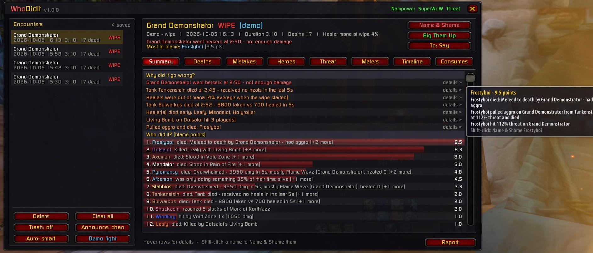

<sub>Type <code>/wdi</code> in game · click <b>Demo fight</b> to try every feature without raiding</sub>

</div>

---

## Highlights

- 🔍 **Why did it go wrong?** A ranked list of wipe causes: tank deaths, healers out of mana, enrage timers, mechanics, aggro pulls, missed interrupts. Click any cause for the full breakdown.
- ☠️ **Death recaps.** The last 15 seconds before every death (hits, heals, debuffs, items, health %), with the cause worked out for you.
- 📋 **Blame board & heroes.** Points for every mistake (standing in fire, pulling aggro, bombing the raid, idling, low DPS) and every game-saving play (clutch heals, shields, taunts, BoP, battle res, dispels).
- 🎯 **Threat & timeline.** Who the boss attacked and why, with the server's threat %. Click any name to jump to that player's own timeline at that moment.
- 🧪 **Consumes & slackers.** Everyone's flask, elixirs, food and protection potions, every potion and healthstone used, and who's missing what their role needs, at every pull and ready check. **Full check** opens DopingControl (built in) for the whole raid matrix: buffs, debuffs, resistances, hit and enchants.
- 🏅 **Hall of Fame.** A running tally over every fight: the biggest heroes and the Hall of Shame of all time, with every clutch play and mistake counted in points, MVPs, the best plays and the worst blunders ever. Post any of it.
- 📣 **Shout-outs.** *Name & Shame* (top 3 to blame) and *Big Them Up*, reports, single mistakes or hero moments, posted to any channel in colour.
- 🏆 **Rankings.** Kill and full-clear times against every guild on your realm and the other realms (from Chronicle), a rival watch when someone beats your times, and optional banter after kills. Click any time to open that guild's whole raid. *Nothing to install: the times arrive in game from the maintainer's [master feed](#master-feed-nothing-to-install).*
- 📝 **Logging.** Drives the Chronicle combat logger: start, save, archive and upload your logs. *Optional: needs ChronicleCompanion, installed normally or by the sync helper.*
- 💀 **Auto Marker.** Marks whole packs in one go, smart marks for tricky fights, quick save for your own packs, and **Learn** to build packs from a normal clear. *WhoDidIt's standard packs come with the download; AutoMarker's ~365 packs are optional (the sync helper downloads them).*
- 💰 **SR MasterLoot.** Soft-res master looting with RollFor, with a step-by-step guide. *Optional: needs RollFor, installed normally or by the sync helper.* **Auto-loot** hands out the trash loot for you.
- 🛡️ **Safe by default.** Nothing goes to a public chat by itself, other guilds' names are never posted without you seeing the text first, and no character names or anything from your PC are shared (with sharing on, just your guild's best times). See [Privacy and security](#privacy-and-security).

## Screenshots

Every window below is the built-in **Demo fight** (made-up raiders) or your own Rankings / Logging data.

### Fights: what happened in the fight

<table>
  <tr>
    <td width="50%"><br><b>Summary.</b> The verdict, every reason the fight went wrong (click one for the details) and the blame board. The panel bottom left posts to chat: <b>Post to</b> picks the channel, then Name &amp; Shame, Big Them Up, and the automatic posts after each fight.</td>
    <td width="50%">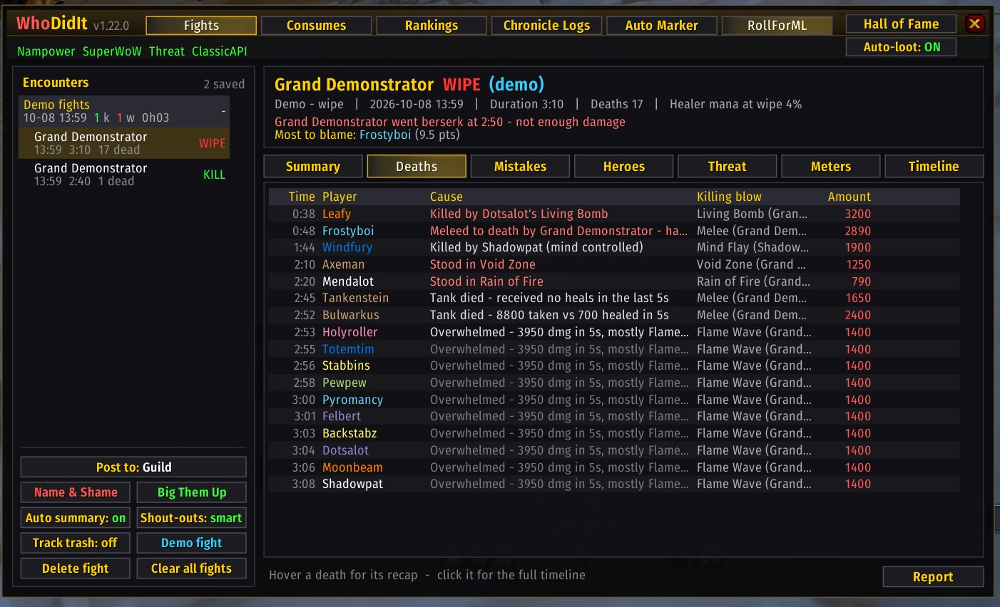<br><b>Deaths.</b> Every death in order, with the cause, the killing blow and how big it was. Hover a death for its last seconds; click it for the full second-by-second recap with a health bar.</td>
  </tr>
  <tr>
    <td width="50%">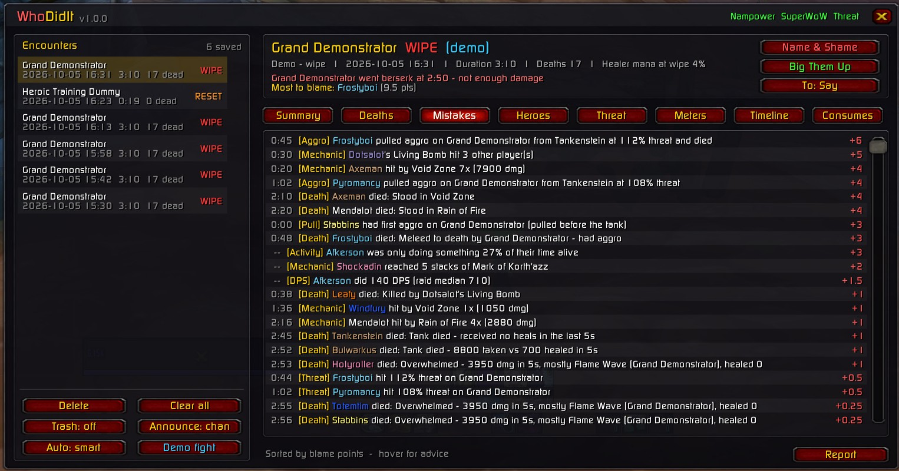<br><b>Mistakes.</b> The blame board with bars, then every mistake with its time, type and blame points. Click a mistake to post it (Ctrl-click previews it). <b>Post mistakes</b> and <b>Name &amp; Shame</b> post the lot.</td>
    <td width="50%">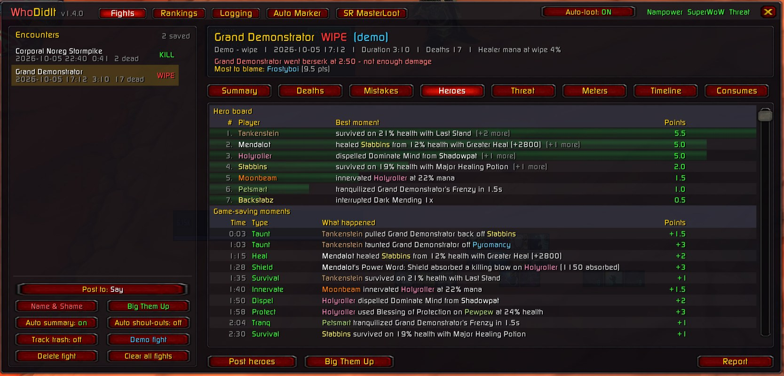<br><b>Heroes.</b> The same layout for the good stuff: the hero board, then every game-saving moment (heal, shield, taunt, dispel, innervate, tranq...). Click a moment to post it; <b>Post heroes</b> and <b>Big Them Up</b> post the lot.</td>
  </tr>
  <tr>
    <td width="50%">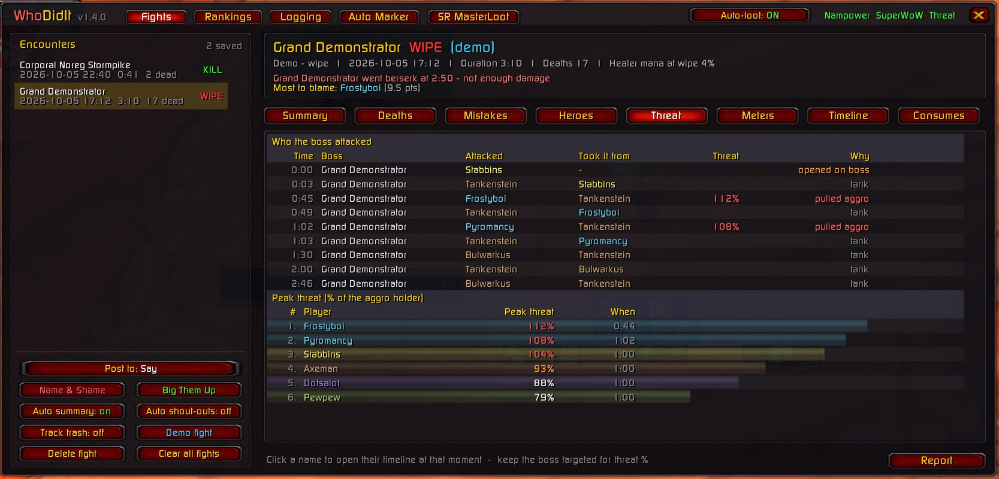<br><b>Threat.</b> Every time the boss changed target, who it went for, who lost it, their threat % and why (tank, pulled aggro, opened on the boss), plus everyone's peak threat. Click a name to see their timeline at that moment.</td>
    <td width="50%">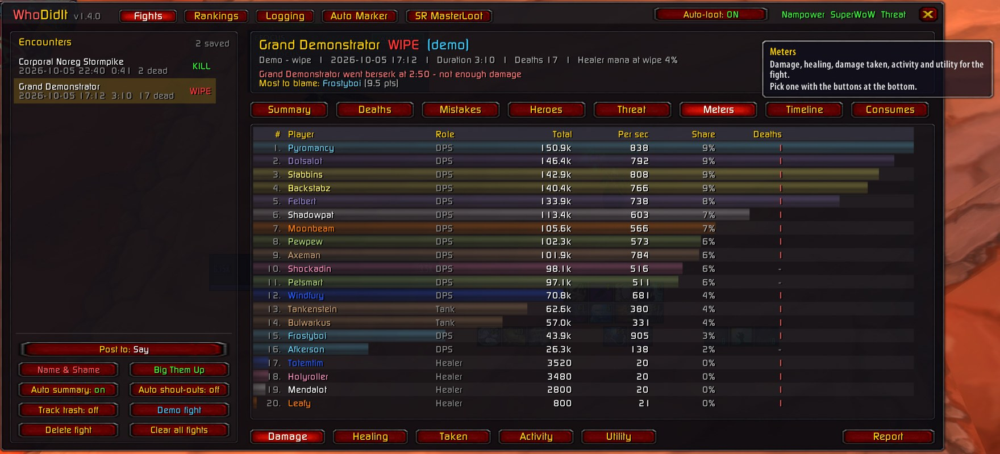<br><b>Meters.</b> Damage, healing, damage taken, activity (how much of their time alive each player did something) and utility (kicks, dispels, tranqs, items), with role, per second, share, crit %, biggest hit and deaths. Hover a player for every spell: total, share, hits, crit % and biggest.</td>
  </tr>
  <tr>
    <td width="50%">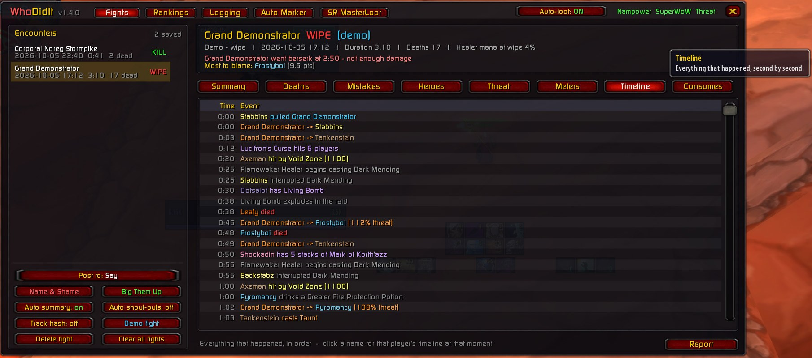<br><b>Timeline.</b> Everything that happened, second by second, colour-coded by kind. Click a name in any line for that player's own timeline, focused on that moment.</td>
    <td width="50%">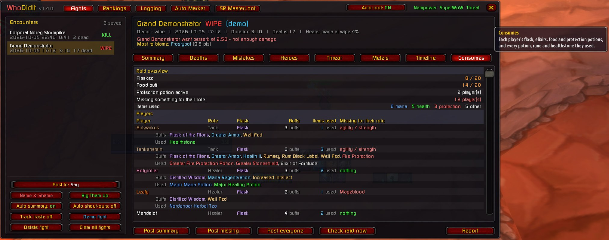<br><b>Consumes.</b> A grid like DopingControl's: players grouped by role (gaps first), a column per consumable slot with the buff's icon, a <b>red X</b> where their role needs something they didn't have, ready counts and items used. <b>Check raid now</b> scans the raid before the pull; <b>Full check</b> opens DopingControl itself.</td>
  </tr>
  <tr>
    <td width="50%">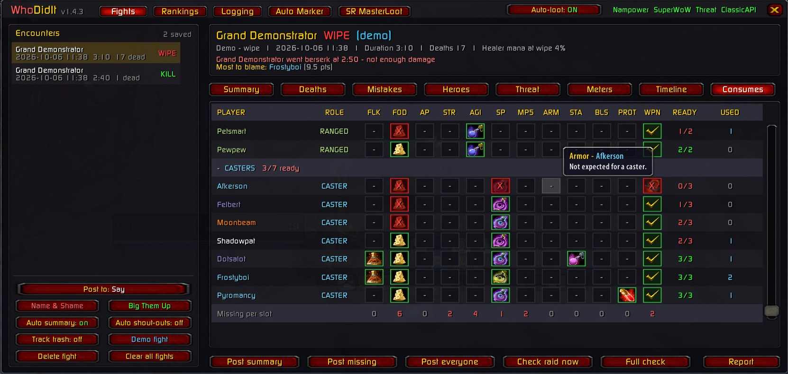<br><b>Consumes, hover and totals.</b> Hover any square for the buff (or why it's empty); click a role header to fold it. <b>Missing per slot</b> at the bottom counts the gaps in each column. <b>Used</b> (top left of the grid) switches to every item used during the fight: mana and healing potions, runes, tea, healthstones, bandages, protection potions and bombs, with counts.</td>
    <td width="50%">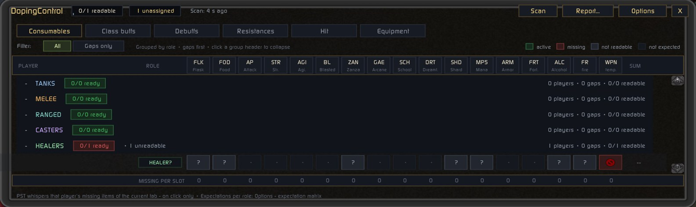<br><b>Full check (DopingControl).</b> DopingControl by ShempError, built in exactly as its author made it: consumables, class buffs, debuffs, resistances, hit and equipment enchants for the whole raid. Open it with <b>Full check</b> on the Consumes tab or <code>/dc</code>.</td>
  </tr>
</table>

### Rankings: kill times and clears

<table>
  <tr>
    <td width="50%">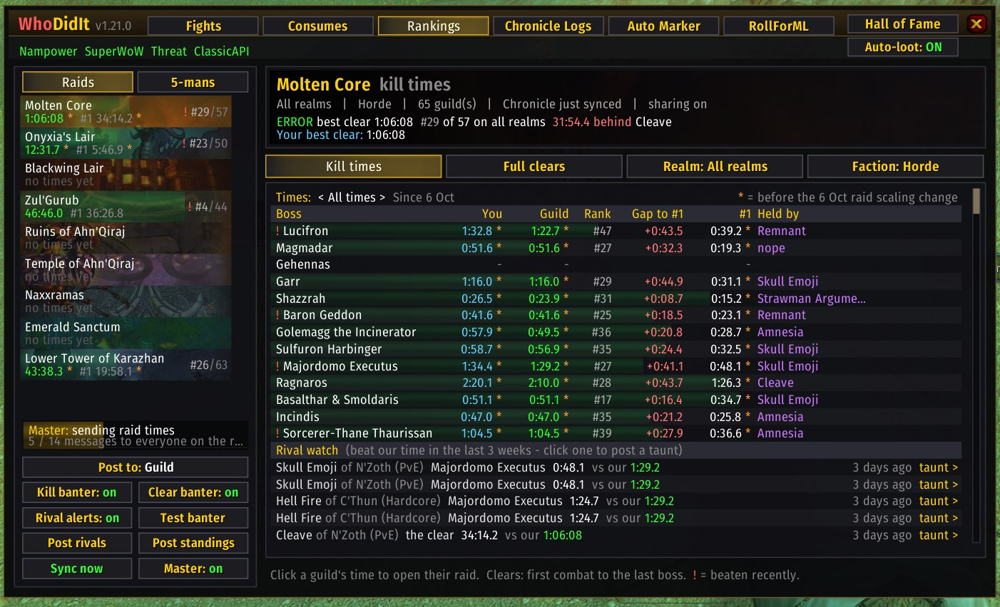<br><b>Kill times.</b> Every boss: your best, your guild's best, its rank, the gap to #1 and who holds it. A red <b>!</b> marks a boss someone recently beat you on; the <b>Rival watch</b> lists them (click to post a taunt). Bottom left: banter, rival alerts and posting the standings.</td>
    <td width="50%">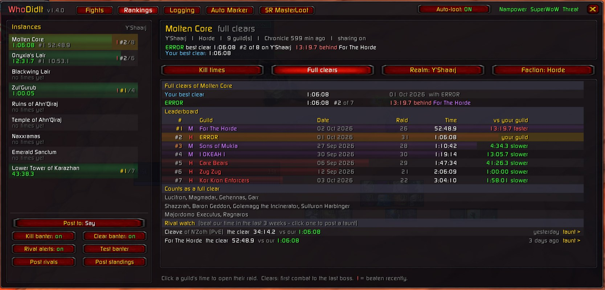<br><b>Full clears.</b> The instance leaderboard with faction, date, raid size, time and how each guild compares with yours. Click any guild's time to open that raid: every boss kill in order, wipes, and a link to the log on Chronicle. <b>Realm</b> switches to the other realms or all of them together.</td>
  </tr>
</table>

### Logging, Auto Marker, SR MasterLoot and Auto-loot

<table>
  <tr>
    <td width="50%">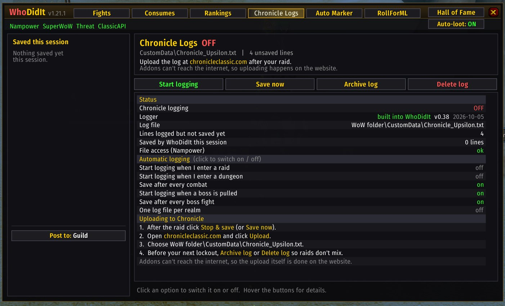<br><b>Logging.</b> The Chronicle combat logger, built in: start and stop logging, save, archive between lockouts, the automatic options (start in raids, save after every boss), and how to upload the log to chronicleclassic.com.</td>
    <td width="50%">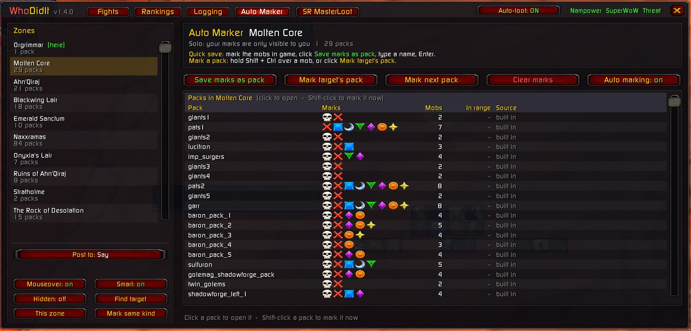<br><b>Auto Marker.</b> Every saved pack in the zone (WhoDidIt's standard packs, AutoMarker's if you have them, and yours) with its marks, mob count and how many are in range. Hold Shift + Ctrl over a mob to mark its whole pack, or mark the next pack along the route. Mark mobs yourself and click <b>Save marks as pack</b> to keep them.</td>
  </tr>
  <tr>
    <td width="50%">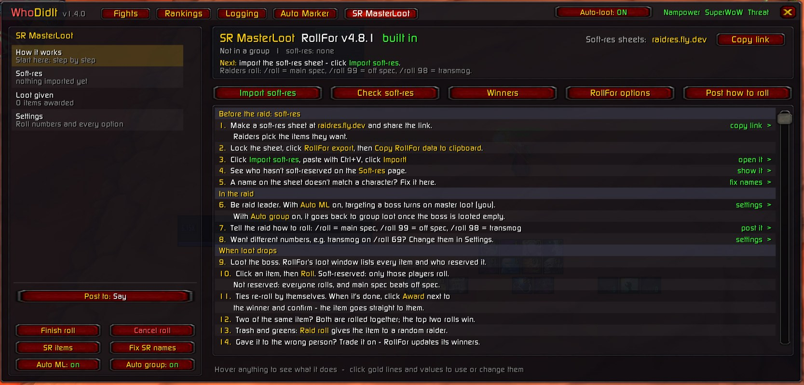<br><b>SR MasterLoot.</b> RollFor for soft-res master looting, with a step-by-step guide (gold lines do that step), the imported soft-res sheet, loot given and every setting explained. <b>raidres.fly.dev</b> with a <b>Copy link</b> button at the top.</td>
    <td width="50%">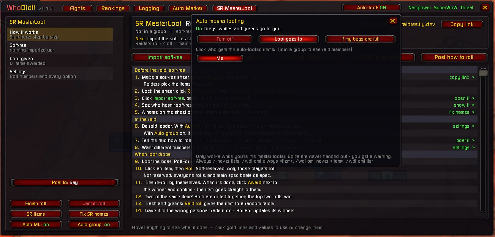<br><b>Auto-loot.</b> The title-bar button shows whether it's on. Click it to pick who gets the trash loot (greys, whites, greens and raid mats) and who gets it when your bags are full. Epics are never handed out.</td>
  </tr>
</table>

## Install

1. Download the [latest code](https://github.com/bdot89/WhoDidIt/archive/refs/heads/main.zip) (or `git clone`).
2. Extract it into `Interface/AddOns/` and **rename the folder to `WhoDidIt`**. GitHub names it `WhoDidIt-main`, and the game won't load it under that name.
3. Make sure **Nampower** and **SuperWoW** are installed (see below), then log in and type `/wdi`.
4. That's it. Rankings fills in by itself from the [master feed](#master-feed-nothing-to-install): the first copy
   takes about 15 minutes in the background while the maintainer is online, and the Rankings tab shows the progress.

**Optional extras** (WhoDidIt works without them):

| Extra | What it adds | How |
| --- | --- | --- |
| [Sync helper](#sync-helper-optional) | The [Chronicle logger](#logging-chronicle-logs), [RollFor](#sr-masterloot-rollfor), [DopingControl](#full-check-dopingcontrol) and [AutoMarker's packs](#auto-marker) installed for you; your own fresher raid times and **Sync now** | double-click `tools\WhoDidIt-Sync.cmd` once (WoW can stay open), then restart WoW |
| [ClassicAPI](#classicapi-optional) | Copy links straight to the clipboard, faster consume scans, "running out" warnings, `/reload` picks up updates | close WoW, double-click `tools\Install-ClassicAPI.cmd` |

You can also install ChronicleCompanion, RollFor or DopingControl the normal way instead of using the helper. The
helper only installs versions the WhoDidIt maintainer has tested (pinned), never whatever is newest.

**Updating:** download the new zip and replace the `WhoDidIt` folder (keep the folder name), or `git pull` if you
cloned it. Your fights, settings and Hall of Fame are in `WTF\...\SavedVariables` and are kept. A full restart of WoW
loads new files (`/reload` is enough with ClassicAPI).

**Nothing is posted to chat by itself** on a fresh install: banter, rival alerts and fight shout-outs are off
until you (or your raid leader) switch them on. Clicking a name or a mistake shows it in **your own chat**;
**Ctrl-click** posts it. More in [Privacy and security](#privacy-and-security).

### Requirements

| Mod | What WhoDidIt uses it for |
| --- | --- |
| **Nampower** (dll) | Damage, healing, swings, buffs/debuffs, deaths and consumables. Without it, only deaths are tracked. |
| **SuperWoW** (dll) | Player and mob names from GUIDs, who the boss is targeting, cast events (interrupts, activity, tranqs, saves). |
| TWThreat (addon, optional) | If it's loaded, WhoDidIt reads the same server threat packets. If not, WhoDidIt asks the server itself (`/wdi threat off` to stop). |
| [ClassicAPI](https://github.com/brues-code/ClassicAPI) (dll, **optional**) | Not needed. Adds a few extras when it's there - see [ClassicAPI (optional)](#classicapi-optional). |

WhoDidIt switches on the Nampower CVars it needs (`NP_EnableAutoAttackEvents`, `NP_EnableSpellHealEvents`, `NP_EnableSpellGoEvents`).

### ClassicAPI (optional)

[ClassicAPI](https://github.com/brues-code/ClassicAPI) (by brues-code, GPL-3.0) is a client DLL that adds many newer
WoW API functions to the 1.12 client. **WhoDidIt does not need it**: everything works the same without it. When it's
installed, these get better:

| | Without ClassicAPI | With ClassicAPI |
| --- | --- | --- |
| **Copy link** buttons (raidres, Chronicle logs) | a box opens with the link selected; press Ctrl+C | the link goes straight on your clipboard |
| Consume checks (every pull, ready check, **Check raid now**) | each raider's buffs are read one at a time (up to 32 calls each) | all of a raider's buffs in one call: quicker scans, less work during the pull |
| Ready-check warnings | who's missing a flask, elixir or food | also whose flask, elixir or food **runs out in under 5 minutes** |
| Updates that add new files | exit WoW and start it again | `/reload` is enough |

**Getting it** (the easy way): close WoW and double-click **`tools\Install-ClassicAPI.cmd`**. It downloads
`ClassicAPI.dll` from the release the WhoDidIt maintainer has tested (pinned in `tools\ClassicApiUpdate.ps1`, with its
SHA-256: a file that doesn't match is refused), backs up `dlls.txt` (`dlls.txt.bak`), copies the DLL into your WoW
folder and adds it to `dlls.txt`. Start WoW through your launcher as usual. It needs VanillaFixes, which loads the DLLs
in `dlls.txt` (most Turtle / OctoWoW setups have it). Nothing updates it behind your back: run `Install-ClassicAPI.cmd`
again (WoW closed) after a WhoDidIt update to get a newer pinned version. Testers: `ClassicApiUpdate.ps1 -Install
-Latest` takes the newest release instead (checked against GitHub's checksum only).
Ask your server first if you're unsure whether client DLLs are allowed.

**By hand:** download `ClassicAPI.dll` from the [releases page](https://github.com/brues-code/ClassicAPI/releases/latest),
put it in your WoW folder and add a line `ClassicAPI.dll` to `dlls.txt`.

**In game:** the title bar shows **ClassicAPI** in green when it's loaded, or grey **ClassicAPI?** when it isn't.
Hover it for what it adds; click it (or type `/wdi classicapi`) for the same in chat. Without it, WhoDidIt mentions it
once, in chat, and never again.

**Removing it:** delete the `ClassicAPI.dll` line from `dlls.txt` (or put `dlls.txt.bak` back) and restart WoW.

## Quick start

1. Type **`/wdi`** and click **Demo fight** (bottom-left). Two sample fights load, a messy wipe and a cleaner kill, and every tab has something to show. **Shift-click** it to watch the wipe play out live at 4× speed.
2. Mark your main tanks: **`/wdi tank <name>`**, or right-click a name in the window. Tanks are auto-detected, but setting them makes aggro blame much more accurate.
3. Pick where posts go with the **Post to** button (bottom left, the same on every tab): Raid, Raid Warning, Party, Guild, Officer, Say, Yell, Only me, or a custom channel (`/wdi channel <name>`).
4. Raid. Fights are recorded automatically when your group engages a boss. **Keep the boss targeted** so threat % gets recorded.

## The window

Across the top: **Fights** · **Rankings** · **Logging** · **Auto Marker** · **SR MasterLoot**, and **Hall of Fame** on
the far right. The row under it holds the **Auto-loot** button (on / off, click to choose who gets the loot) and the
lights for Nampower, SuperWoW, threat data and the optional ClassicAPI (hover them for what each does).
Bottom left, on every tab: **Post to** (where WhoDidIt posts) and that tab's buttons. Hover anything to see what it does.

**Fights** has one tab per view of the selected fight:

| Tab | What it shows |
| --- | --- |
| **Summary** | The verdict, the ranked wipe causes (click for details), the blame board, the top heroes and raid notes (missing buffs, boss debuff uptime) |
| **Deaths** | Every death with its cause. Hover for the recap, click for the second-by-second timeline with health bars |
| **Mistakes** | The blame board (with bars), then every mistake with its time, type and points, laid out like Heroes. Click a mistake to see it in your chat (Ctrl-click posts it). **Post mistakes** / **Name & Shame** buttons |
| **Heroes** | The hero board (with bars), then every game-saving moment with its time, type and points. Click a moment to see it in your chat (Ctrl-click posts it). **Post heroes** / **Big Them Up** buttons |
| **Threat** | Boss target changes with threat % and a verdict, plus peak threat per player. Click a name (Attacked or Took it from) to open that player's timeline, filtered to them and scrolled to that moment |
| **Meters** | Damage, Healing, Taken, Activity, Utility (interrupts, dispels, tranqs, items) |
| **Timeline** | Everything that happened, in order. Click a name in any line (or on the Threat tab) to see that player's timeline, with the moment highlighted; "show everyone" widens it again |
| **Consumes** | **Buffs**: a grid of every player's consumable buffs by slot, grouped by role, with a red X where their role needs something (the **slacker check**). **Used**: every potion, rune, tea, healthstone, bandage and bomb used in the fight. **Post summary / missing / everyone**, **Check raid now** and **Full check** (DopingControl) buttons |

### Clicking names

Every player name in the window (blame board, Heroes, Meters, Consumes) works the same way:

| Click | Does |
| --- | --- |
| **Click** | Show that player's overview for the current tab (blame, hero plays, stats or consumes) in your own chat |
| **Ctrl-click** | Post it to your channel (the **Post to** button) |
| **Shift-click** | Name & Shame just them |
| **Alt-click** | Big them up |
| **Right-click** | Mark / unmark as a tank |

## Rankings

The **Rankings** button (title bar, or `/wdi rankings`) shows kill times and full clears for every raid:

- **Kill times:** your personal best, your guild's best and rank, and the fastest guild on the realm for every boss. Click a boss for its full leaderboard; Shift-click to jump straight to the #1 guild's raid.
- **Open any raid:** click a guild's time on any leaderboard (or your own pinned times). The raid page lists every boss
  killed in that raid, in order. For each kill it shows the time, when it happened in the raid, wipes before it, how it
  compares with your guild's best, and where it would rank. There's also a **copy link** to the raid on Chronicle.
  Click a boss there for its leaderboard.
- **Full clears:** first combat inside the instance to the last required boss, all in one run. Optional bosses (ZG's Edge of Madness, AQ40's Bug Trio / Viscidus / Ouro) aren't required. A run in progress shows which bosses are down.
- **Closest to you first:** it opens on your current instance, realm and faction, with your own and your guild's times pinned at the top. **Realm** and **Faction** switch the view.
- **Every guild on the server:** see [where the raid times come from](#where-the-raid-times-come-from) below.

A kill or clear counts for the raid's majority guild (at least half the raid). Personal bests are kept per character.

**Realm** cycles your realm → **All realms** (every guild on the server ranked together, with realm names) → each
other realm. Every leaderboard time is compared with your guild's ("1:38.6 faster" / "3:51.1 slower"). The left column
shows your guild's clear, its rank (gold / silver / bronze) and a green bar for how close you are to #1.

### Times before and after the 6 Oct raid scaling change

OctoWoW changed how raids scale with the number of players on **6 October 2026**
([patch notes](https://octowow.st/forum/viewtopic.php?t=2816)). Enemy health and melee damage now scale smoothly
with raid size: raids under 30 players have it harder per player (at 20 of 40, or 12 of 20, about 15% more health
and damage per player than a full raid), some trash lost extra small-raid reductions (ZG's Bloodseeker Bats and
Zulian Prowlers, MC's Flamewakers, Flamewaker Protectors and Core Ragers), and raids over 30 are no longer punished
by the old system. Times from before and after aren't directly comparable, so Rankings keeps them apart:

- **All times** (the default): every best, with an amber **\*** on any time set before the change. Hover it for
  why.
- **Since 6 Oct**: click the **Times** line at the top of Rankings to rank only times set since the change, with
  their own #1s, gaps and your guild's rank. Click again for all times.
- Where they come from: the sync helper (and so the master feed) works out every guild's best kill and best full
  clear since the change from Chronicle's raid logs. A clear counts the bosses every top run of that raid killed,
  timed to the last of them, which matches Chronicle's own clear times for 191 of 193 top runs. Your own WhoDidIt
  recordings and other users' shared times are split by their date.
- Banter compares a new kill only with other guilds' times since the change. Your personal and guild bests are
  still all-time.
### Where the raid times come from

Rankings fills up from three places (hover a row to see which one a time came from):

| Source | What it brings | You need |
| --- | --- | --- |
| **[Master feed](#master-feed-nothing-to-install)** | Every guild's Chronicle times on every realm, passed on in game by the maintainer's character | just the addon |
| **[Sync helper](#sync-helper-optional)** | The same Chronicle times, fetched by your own PC every 10 minutes, plus **Sync now** | the optional helper (PowerShell, built into Windows) |
| **Other WhoDidIt users** | Each guild's own bests, shared by its members right after the kill: before anyone uploads a log, and from guilds that never upload | just the addon |

With both the feed and the helper, whichever copy is newer is used.

### Master feed (nothing to install)

Chronicle's times are on a website, and WoW addons can't go online. So the maintainer runs the sync helper, and while
one of their master characters is online, their WhoDidIt passes the times on to every other WhoDidIt user on the realm
over WhoDidIt's hidden channel. Everyone else needs **nothing but the addon**: no helper, no PowerShell, no settings.

- **After a fresh install:** within a minute of the master being online, your WhoDidIt asks for the times. The first
  copy is everything: about 530 messages, one every 1.6 seconds or so, so about 15 minutes for OctoWoW (if one went out just before
  you logged in, the next can take up to half an hour). It comes in quietly in the
  background while you play. After that only what changed is sent (seconds), and one send serves everyone listening.
- **While you wait:** the top of the Rankings tab says what's happening: "Receiving them from Upsilon" with a progress
  bar, the % and the minutes left; "Upsilon is online… your WhoDidIt is asking for them"; or "Waiting for Upsilon to
  come online" (nothing to do). Under it, **How the sharing works** explains what arrives and what doesn't. Chat says
  when the first copy starts and when it's in ("Raid times are in: 1,757 guild records from Upsilon").
- **Kept:** what arrives is saved on your PC, so Rankings is full at your next login even when the master is offline,
  and it updates as soon as they're back. The bar at the bottom of Rankings shows "Raid times from Upsilon - they're
  online, updates are live"; the header says "Chronicle via Upsilon".
- **Raid details:** when you open a raid (click a time), its boss list is asked for and sent there and then.
- **All realms:** the master sends every realm's times (C'Thun, N'Zoth and Y'Shaarj in one). A chat channel only
  reaches players on its own realm, so there's a master character on each realm.
- **Only the maintainer can be the master.** The master characters are written into the addon (`B.MASTERS` in
  `Board.lua`), and every copy of WhoDidIt ignores feed messages from anyone else. Character names are unique per realm
  and the channel only reaches the sender's own realm, so nobody else can send as them while those characters exist.
  The **Master** button and `/wdi master on|off` only work on those characters; someone editing their own copy only
  fools themselves.
- **Your own list:** `/wdi master list` shows whose times you take. `/wdi master remove <name>` stops trusting one (for
  example if a master character were ever deleted or renamed and someone else took the name); `/wdi master add <name>`
  trusts another character on your realm, such as another guild's own master. Only add someone you trust.
- **Factions:** custom chat channels are split by faction, so a master only feeds players of its own faction.
- **Polite by design:** anyone may ask the master, so asking is rationed. Each character can ask once every 5 minutes
  and for 6 raid boss lists every 10 minutes; streams start at least a minute apart, and a full copy goes out at most
  every 30 minutes however many characters ask. One player can't keep the master's character talking.
  Messages go out at most one every 1.6 seconds, under the server's chat limit ("You must wait 7 Seconds before
  speaking again"); if it ever kicks in, WhoDidIt waits, resends what was dropped, slows down for good and hides the
  warning, which was about its own hidden messages, not your chat. A stream that
  misses a message keeps what did arrive.
- **Opting out:** `/wdi feed off` ignores the feed (`/wdi feed on` takes it again). `/wdi share off` leaves the hidden
  channel altogether.

What's in the feed, and what never is, is listed under [Privacy and security](#privacy-and-security).

### Sync helper (optional)

WoW addons can't go online, so a small helper does it for them. `tools\WhoDidIt-Sync.cmd` (PowerShell, built into
Windows) uses Chronicle's public [External API](https://legacy.chronicleclassic.com/developers/api) to pull:

- **full clears** from Chronicle's speedrun leaderboards
- **boss kill times** from every uploaded raid log on your server (OctoWoW: C'Thun, N'Zoth, Y'Shaarj)
- **your personal bests:** it reads the character folder names in your `WTF` folder and looks for them in the raid
  rosters it downloads. The names never leave your PC.

It writes them to `CustomData\WhoDidIt_Chronicle.txt`, and WhoDidIt reads that file live through Nampower, with no
`/reload`. It also installs and updates the built-in addons and packs (see [Install](#install)).

```
tools\WhoDidIt-Sync.cmd                    sync now, then every 10 minutes (close the window to stop)
tools\WhoDidIt-Sync.cmd -Once              sync once and exit
tools\WhoDidIt-Sync.cmd -Days 30           only raids from the last 30 days (default 90)
tools\WhoDidIt-Sync.cmd -Server "Kronos"   another Chronicle server
tools\WhoDidIt-Sync.cmd -UpdatesOnly       only install / update the built-in addons and the mob packs
tools\WhoDidIt-Sync.cmd -LoggerOnly        only install / update the built-in Chronicle logger
tools\WhoDidIt-Sync.cmd -NoLoggerUpdate    leave the Chronicle logger alone
tools\WhoDidIt-Sync.cmd -NoRollForUpdate   leave RollFor alone
tools\WhoDidIt-Sync.cmd -NoDopingUpdate    leave DopingControl alone
tools\WhoDidIt-Sync.cmd -NoPackUpdate      leave the mob packs alone
tools\WhoDidIt-Sync.cmd -DetailsPerSync 600  read more raids in full per sync (default 150)
```

- **First sync:** reads every raid log from the last 90 days once, about 45 minutes for OctoWoW. Times appear in game
  as it goes.
- **Later syncs:** only new uploads, plus the raids behind the times on the boards in full detail (150 per sync, so
  clicking a time shows the whole raid).
- **Progress in game:** the bar at the bottom left of Rankings shows the step, how far it is and about how long is
  left, or "Up to date - next sync in 7 min". It also says if the helper isn't running, or has never run on this PC.
- **Sync now:** the button under the bar asks the running helper to sync straight away, so you get the newest times
  right after a raid is uploaded.
- **Rate limit:** the helper stays within Chronicle's limit (about one request a second) and caches what it has read in
  `CustomData\WhoDidIt_ChronicleCache.json`. The API is marked experimental by Chronicle, so it may change.
- **Faction:** comes from the raiders' races. OctoWoW raids cross-faction, so many guilds show as **M** (mixed).

**Run it in the background:** double-click **`tools\AutoSync-On.cmd`** once. The helper then runs with **no window**
and keeps itself running: it starts when you log into Windows, when you unlock the PC (also after sleep, for PCs that
are never shut down), and every 15 minutes if it ever stopped, and right away. It adds one scheduled task for your
Windows user (`WhoDidIt-Sync`, no admin rights) and a tiny launcher script (`tools\WhoDidIt-Sync-Hidden.vbs`);
nothing else changes. **`tools\AutoSync-Off.cmd`** removes both and stops the helper. (`AutoSync.ps1 -Minimised`
uses a Startup shortcut with a minimised window instead.) Only one copy of the helper ever runs, so the extra starts,
or double-clicking `WhoDidIt-Sync.cmd` as well, do no harm.

**Maintainer:** keep AutoSync on and switch **Master** on (bottom left of Rankings, only shown on the master
characters). Logging into the master character on a realm feeds that realm.

### Banter

**Kill banter** and **Clear banter** are **off by default**; most raids leave them to the raid leader. When they're on,
WhoDidIt posts a fun line to the **Post to** channel after every boss kill or full clear, picking a random kind of line
so it doesn't get repetitive:
- **our own best**: a new guild best (and by how much), a photo finish (under 2 seconds), a huge leap (15% or
  more), how much slower ("…{d} of sightseeing"), a near miss (under 3 seconds off) or a disaster (30% slower)
- **speed kills**: a boss down in under a minute
- **our realm**: passed another guild, still behind one, #1, or our rank
- **the other realms**: faster than anyone on N'Zoth (PvE), behind a guild on C'Thun (Hardcore), or the fastest on
  every OctoWoW realm. Realm types are set in `Data.lua` (`D.realmTypes`).
- **rivals**: took a boss back from a guild that beat us, or how long they've held it

Banter never names another guild: it says "another guild" instead (see [Privacy and security](#privacy-and-security)).
It trolls you when you're slow and bigs you up when you're fast. With several WhoDidIt users in the raid, only one of
them posts each line. Toggle it with **Kill banter / Clear banter** in Rankings or `/wdi banter kills|clears on|off`,
and preview a line with **Test banter** or `/wdi banter test`.

### Rival watch

Every minute WhoDidIt checks the new times from Chronicle (feed or helper) and from WhoDidIt users on the realm. Any
time that beats our guild's best, and was set after it, goes on the **Rival watch**. On another realm, it counts when
that realm's fastest guild gets under our time.
- Rankings marks those instances and bosses with a red **!** and lists them under **Rival watch**. Click one to see
  it in your chat; Ctrl-click to post it with a taunt (you see the text first).
- **Rival alerts** (off by default): when the raid enters that instance, WhoDidIt shows who beat us in **your own
  chat**, once per instance visit.
- **Post rivals** posts them for the instance you're looking at. **Post standings** posts what's on screen: a boss's
  top 3, the instance's top 3 clears, or on how many bosses we're #1 and who has the rest. Use **Realm: All realms**
  to compare across the server. Both show you the exact text before it goes out.

## Logging (Chronicle logs)

WhoDidIt has Chronicle's logger built in: **ChronicleCompanion**, the official addon for
[chronicleclassic.com](https://chronicleclassic.com), made by Emyrk. You don't need to install it separately.

- **Install:** `tools\WhoDidIt-Sync.cmd` downloads it from the official source,
  [github.com/Emyrk/ChronicleCompanion](https://github.com/Emyrk/ChronicleCompanion), into `WhoDidIt\Chronicle\`.
  Restart WoW afterwards; a `/reload` isn't enough the first time. To install or update only the logger, run
  `tools\WhoDidIt-Sync.cmd -LoggerOnly`.
- **Updates:** the helper installs the version the WhoDidIt maintainer has tested (pinned to a commit), never whatever
  is newest; newer Chronicle versions arrive with a WhoDidIt update. While it runs it checks every hour that you have
  the pinned version. One that arrives while you're playing installs when you close WoW, so the logger never changes
  mid-raid. If a version can't be adapted safely, the helper keeps the current one and says why.
- **What's changed:** nothing in Chronicle's logging. The helper only lets its files run from inside WhoDidIt: they
  start with WhoDidIt, take their version from `Chronicle\wdi_version.lua`, and find their minimap icons in the new
  folder. `/chronicle`, `/chron`, `/clog`, the minimap button, the options panel and the log files are all exactly as before.
- **Already have ChronicleCompanion installed?** WhoDidIt's copy stands down, so nothing is logged twice, and it asks
  once whether to switch the separate addon off. **No** keeps it running with its own settings untouched; **Yes**
  switches it off from your next login and the built-in copy takes over with your settings.
- Chronicle's code isn't stored in this repository. It's downloaded from its source, at the pinned commit.

The **Logging** button (or `/wdi logs`) drives it from the WhoDidIt window. It shows which logger is running and its version:

- **Start logging / Stop & save**, **Save now**, **Archive log** (between lockouts) and **Delete log**
- Chronicle's auto-logging settings (raids, dungeons, save after combat, one file per realm)
- WhoDidIt extras: **start logging when a boss is pulled** and **save after every boss fight**
- Live status: logging on/off, the log file, unsaved lines, and what was saved this session
- Step-by-step upload instructions. The upload itself is done on the website.

## Auto Marker

The **Auto Marker** button (or `/wdi marks`) is WhoDidIt's auto marker. It puts raid marks on a whole pack of mobs at once.
Every mob has a fixed GUID, so a pack is a list of mobs and the mark each one gets.

**Marking a pack**

- Hold **Shift + Ctrl** (or **Shift + Alt**) and move the mouse over a mob to mark its whole pack.
- Or press a key, or click **Mark target's pack** (the mob under your mouse, else your target).
- **Mark next pack** works through the zone's packs in route order. **Clear marks** removes them all.
- Raid lead and assists mark for everyone. Otherwise the marks are only visible to you (SuperWoW local marks), and you can mark solo too.

**Saving your own packs (quick save)**

1. Mark the mobs in game the way you want them (right-click a portrait > Raid Target Icon).
2. Click **Save marks as pack**. The window also lists what's marked right now; click that row.
3. Type a name and press Enter. Using an existing pack's name updates that pack.

**The Auto Marker window**

- **Zones** on the left: where you are first, then zones with your packs.
- **Packs**: each pack's marks as icons, its mob count, how many of its mobs are in range right now, and whether it's
  built in or yours. Click a pack to open it; Shift-click marks it.
- **Inside a pack**: every mob with its mark, NPC id and status (in range, marked, dead). Click a mob to pick its mark from all eight;
  right-click takes it out. You can also add your target, rename the pack, or delete it. Changing a built-in pack saves
  your own copy, and **Restore** brings the original back.

**Built-in packs.** About 1,800 mobs in about 365 packs: Naxx, AQ40, AQ20, BWL, MC, ZG, Onyxia, Emerald Sanctum,
Karazhan, Timbermaw Hold and more. They're the packs collected by the [AutoMarker](https://github.com/MarcelineVQ/AutoMarker)
addon (by Weird Vibes). `tools\WhoDidIt-Sync.cmd` downloads them into `Marks\packs.lua`, at the commit the WhoDidIt
maintainer has pinned. Only the pack data is used (read, never run), converted to WhoDidIt's format. Your own packs are saved separately and never
overwritten. Run `tools\WhoDidIt-Sync.cmd -UpdatesOnly` to fetch just the packs and the built-in addons.

**Smart marks.** These cover what fixed packs can't. They put marks up by themselves, so they're **off until you say
yes**: WhoDidIt asks the first time you enter a raid (or switch them with **Smart** on the Auto Marker tab). Each one
can be switched off in its zone's list, and a mark someone else set is never moved:

| Where | What |
| --- | --- |
| Naxxramas | Razuvious' Understudies, Anub'Rekhan's Crypt Guards, Faerlina's adds (new GUIDs every pull), Plague Quarter gargoyles (whole pack on wake-up), Kel'Thuzad's soldiers that get close |
| AQ40 / AQ20 | Skeram's images after each split, Fankriss' worms, Buru's eggs (a killed egg's mark goes to the next one that respawns) |
| MC / BWL | Majordomo's Flamewakers, skull on the highest-health Core Hound (shared with other WhoDidIt markers), Nefarius |
| ZG / Onyxia / ES | Arlokk when she reappears, Onyxian Hatchers, Solnius' adds in kill order |
| Karazhan / Rock of Desolation | Gnarlmoon's owls, Ley-Seekers, Incantagos' affinities, Sanv Tas'dal's adds, Rupturan's fragments, exiles and mounds, Mephistroth's doomguards |
| Timbermaw Hold | Rotgrowl's Kodiak, the chieftain's Illuminators and Shadowkeepers, Ursol's Corrupters |
| Dungeons | BRD Flame Keepers, DM Ironbark Protectors, a Jed Runewatcher alert in UBRS |

**Keys:** Esc > Key Bindings > WhoDidIt has keys for marking the pack, marking the next pack, saving marks and clearing
marks.

**Commands:** `/wdi mark`, `/wdi marks next|clear|save [name]|add <pack>|info|type|name <mob>|on|off`. `/am` works too.

**Coming from AutoMarker?** If it's still installed, WhoDidIt stands by (AutoMarker keeps marking). Once WhoDidIt has
its raid packs, it brings over any packs you saved with `/am add` and asks once whether to switch AutoMarker off.

**Learn packs (WhoDidIt's own packs).** WhoDidIt can build raid packs from what you see in game, so it doesn't need
anyone else's data:

1. Click **Learn** (bottom left of the Auto Marker tab, or `/wdi marks learn on`) and walk through a raid. A normal
   clear does it. Every mob that comes into view is noted with where it stands (read while it's out of combat, so
   it's its spawn spot), its name, whether it uses mana and its health. Bosses and critters are skipped.
2. Click **Make packs** (or `/wdi marks build [yards]`). Mobs within 12 yards of each other become one pack, in the
   order you met them. Marks follow WhoDidIt's own priority: healers and casters first, then the toughest (skull,
   cross, square, moon, triangle, diamond, circle, star). They're saved as your own packs ("Learned 01 - Molten
   Giant x2"); change any mark by hand. What was noted is kept, so you can rebuild with another gap; a learned pack
   you changed by hand is kept as it is when you make packs again. `/wdi marks learn clear` forgets the noted mobs
   once you're happy.
3. **Standard for everyone (maintainer):** `/wdi marks export` writes your packs (learned and saved, never edited
   AutoMarker packs) to `CustomData\WhoDidIt_StdPacks.lua`; `tools\Publish-Packs.cmd` ships them as
   `DefaultPacks.lua`. Everyone who downloads WhoDidIt then gets them, with no helper.

**Marks someone set by hand are left alone.** WhoDidIt remembers the marks it put up itself; a mob with a mark it
didn't set keeps it, and it won't take an icon that's on another mob. Mouse-over marking (**Shift + Ctrl** over a mob)
is off by default: switch on **Mouseover** at the bottom left of the Auto Marker tab.

## Consume check (slackers)

Every pull, WhoDidIt reads each raider's consumable buffs, and their weapon oil or stone (or shaman imbue) with SuperWoW. It then
checks them against what their role should bring:

| Role | Must-haves |
| --- | --- |
| Tank | flask, food, a defense elixir, an agility / strength buff |
| Melee | flask, food, Mongoose / agility, strength / AP, a weapon stone |
| Ranged | food, Mongoose / agility |
| Caster | flask, food, an arcane elixir, a wizard oil |
| Healer | flask, food, Mageblood, a mana oil |
| Shaman tank | as Tank, plus Rockbiter Weapon (Windfury or Frostbrand also count; an oil or stone does not) |
| Shaman melee | as Melee, but a weapon imbue (Windfury etc.) instead of a stone |

Flasks are only expected in the big raids (MC, BWL, AQ40, Naxx, ES, Karazhan).
- **Consumes tab:** a grid with players grouped by role (tanks, healers, melee, ranged, casters; click a group to
  fold it, players with gaps first) and a column per slot: FLK flask, FOD food, AP, STR, AGI, SP spell power, MP5,
  ARM armor, STA stamina, BLS Blasted Lands, PROT protection potion, WPN weapon. Green = they had it (hover for the
  buff), **red X** = their role needs it, **-** = not expected, **?** = out of range. **Ready** shows must-haves had
  out of needed, **Used** the items used. The top line ("Missing something", click to post) and **Missing per slot**
  at the bottom sum it up.
- **Used** (top left of the grid): every item each player used during the fight, a column per kind (protection,
  healthstones, healing potions, mana gems, mana potions, runes, tea, bandages, explosives, other potions, everything
  else) with the count on the icon. Hover a square for the exact items; the bottom row is the raid's total.
- **Frozen at death:** when someone dies, WhoDidIt freezes what was off cooldown at that moment: their potion (all
  potions share one 2 minute cooldown), a healthstone (if there's a warlock in the raid) and their class's lifesavers
  (Shield Wall, Last Stand, Divine Shield, Blessing of Protection, Lay on Hands, Ice Block, Evasion, Vanish, Feign
  Death, Desperate Prayer, Frenzied Regeneration). In the **Used** grid, a dead player's **Died** column shows the
  time (and a yellow **!** if something was ready), and the healing potion / healthstone squares turn **yellow with a
  !** when they were off cooldown and unused. Hover the name for the class cooldowns too. The death's tooltip and its
  full recap on the Deaths tab show the same list. Cooldowns are followed for the whole session, so a potion drunk just
  before the pull still counts. It can't see bags, so "ready" means not used within its cooldown, not that they
  carried one.
- **Name & Shame:** a **Consume Slacker** award.
- **Ready checks:** every ready check (and **Check raid now**, or `/wdi check`) scans the raid and shows you who's
  missing what. Only you see it; Shift-click or `/wdi check post` posts it. Turn it off with `/wdi readycheck off`.
- **Fairness:** a player who can't be read (out of range) shows **?**. They're never counted as missing anything.

The spell IDs, the aura names this server really uses and the per-role idea come from **DopingControl** by ShempError
(MIT licence, [github.com/ShempError/DopingControl](https://github.com/ShempError/DopingControl)).
With [ClassicAPI](#classicapi-optional), ready checks also list whose flask, elixir or food runs out in under 5 minutes.

### Full check (DopingControl)

DopingControl itself is built into WhoDidIt, exactly as its author made it. Click **Full check** on the Consumes tab
(or type `/dc`) for its window:

- **Consumables**: eleven slots per player (flask, food, attack power, strength, agility, spell power, mana regen,
  armor, stamina, fire protection, weapon oil / stone / imbue), showing the actual buff icon.
- **Class buffs**: Arcane Intellect, Mark of the Wild, Fortitude, Shadow Protection, Emerald Blessing, Soulstone.
- **Debuffs**: a column for each debuff actually on the raid.
- **Resistances**: each player's fire / nature / frost / shadow / arcane total, rebuilt from their gear.
- **Hit**: melee, ranged and spell hit against the cap, with every source on its own line.
- **Equipment**: every slot, with missing enchants marked.
- **Options**: what each role and class is expected to have, a whisper / report button and a minimap button.

A player it can't read is shown as unknown, never as missing. `tools\WhoDidIt-Sync` downloads it from the author's
GitHub and keeps it up to date (it isn't stored in this repository). If you already have DopingControl installed,
WhoDidIt asks once whether to switch the separate copy off (No keeps it, with its own settings).

## Auto-loot (auto master looting)

The **Auto-loot** button in the title bar (next to Nampower) shows whether it's on.
- When it's on and you're the master looter, every grey, white and green item is handed out as soon as you open a
  corpse, bind on pickup included. So are raid mats: Wartorn scraps, AQ idols, Fiery / Lava Cores, Elementium.
- Epics are never handed out. You get a warning and a sound instead.
- **Click** the button to choose who gets the loot (you, or anyone in the raid). You can also choose who gets it
  **if your bags are full**: once you run out of space, the loot goes to them instead. So someone else can collect all
  the trash loot, or you can collect it for them.
- **Right-click** turns it on or off.
- Commands: `/wdi aml` (on / off), `/wdi aml to <name|me>`, `/wdi aml backup <name|none>`, `/wdi aml always|never <item>`,
  `/wdi aml list`. `/automl` works too.

It replaces the AutoMasterLooter addon (by balake).

## SR MasterLoot (RollFor)

The **SR MasterLoot** button (or `/wdi loot`) is for master looting. WhoDidIt has [RollFor](https://github.com/sica42/roll-for-vanilla)
built in, the master-loot roller by Obszczymucha. It's sica42's 1.12 fork (v4.8.1), the newest version that still runs on
the 1.12 client; the original RollFor has moved to TBC only. RollFor does the rolling itself: its loot window lists every
item and who soft-reserved it, it runs the roll, handles ties, and gives the item to the winner when you click **Award**.

**The SR MasterLoot tab**

- **raidres.fly.dev** is shown at the top right, with a **Copy link** button (straight to your clipboard with [ClassicAPI](#classicapi-optional), otherwise Ctrl+C in the box that opens), for anyone who doesn't know where soft-res sheets are made.

- **How it works**: step by step, from making the soft-res sheet to awarding the last item, plus every command. Gold
  lines do that step when clicked (open the import window, post how to roll, and so on).
- **Soft-res**: the imported sheet, with each player's spec and reserved items, whether they're in the raid, and who's
  in the raid without a reserve (with a button to post that to the raid).
- **Loot given**: every item awarded, newest first: item, winner, main spec / off spec / transmog / soft-res / raid roll,
  and the roll.
- **Settings**: everything explained in plain words; hover any line for a summary. Saved per character.
  - **Roll numbers**: click one to change what raiders type, e.g. transmog on `/roll 69` instead of `/roll 98`.
    Also: transmog rolls on or off, how long a roll lasts, and a reset back to 100 / 99 / 98. The guide, the
    header and **Post how to roll** all use your numbers.
  - **Switching the loot method for you**: **Auto master loot** switches the raid to master loot (you) when you
    target a boss; **Auto group loot** switches back to group loot once the boss is looted empty. Both are also on
    the left as **Auto ML** and **Auto group**.
  - Rolling and looting options, the roll window for raiders, and a link to RollFor's own options window.
- **Header**: the loot method and looter, and the next thing to do ("import the soft-res sheet", "target a boss",
  "Ready").
- **Buttons**: Import soft-res, Check soft-res, Winners, RollFor options and Post how to roll across the top. Finish
  roll, Cancel roll, SR items, Fix SR names, Auto ML and Auto group on the left. Hover any button for what it does.

**A raid night in short**

1. Make the sheet at [raidres.fly.dev](https://raidres.fly.dev), lock it, click **RollFor export** > **Copy RollFor data to clipboard**.
2. Click **Import soft-res**, paste, click **Import!**. Then check the **Soft-res** page for anyone missing.
3. Be raid leader: **Auto master loot** turns master loot on when you target a boss. Click **Post how to roll** (`/roll`
   main spec, `/roll 99` off spec, `/roll 98` transmog).
4. Loot the boss, click an item, **Roll**, then **Award** the winner. Soft-reserved items are only rolled by those players.
5. Trash: **Raid roll** gives the item to a random raider.

All of RollFor's own commands work as before: `/rf`, `/arf`, `/rr`, `/irr`, `/fr`, `/cr`, `/sr`, `/srs`, `/src`, `/sro`,
`/rfw`, `/rfo`, `/htr`, `/rf config`. So do its minimap button and its key bindings (Esc > Key Bindings > RollFor).

**How it's built in.** RollFor isn't stored in this repository. `tools\WhoDidIt-Sync.cmd` downloads the version the
WhoDidIt maintainer has tested (v4.8.1, pinned to a commit) from [sica42/roll-for-vanilla](https://github.com/sica42/roll-for-vanilla)
into `WhoDidIt\RollFor\`, and installs a newer pinned version (with a WhoDidIt update) while WoW is closed. Restart WoW after the first install; a `/reload` isn't enough.
The only changes to RollFor's files: its version comes from `RollFor\wdi_version.lua`, its images are found in the new
folder, and its library list is expanded into `WhoDidIt.toc`. Its key bindings are added to WhoDidIt's. Nothing in how
it rolls is changed, and it still talks to raiders' copies of RollFor (roll windows, version checks).

**Already have RollFor installed?** WhoDidIt's copy stands down, so nothing runs twice, and it asks once whether to
switch the separate addon off. **No** keeps it running with its own settings untouched. **Yes** switches it off, and
from your next `/reload` WhoDidIt's copy takes over with that character's settings, soft-res sheet and winners.

## The panel under the list

The bottom of the left column is laid out the same way on every tab. Hover any button for what it does.

| | |
| --- | --- |
| **Post to: Raid** | Where everything WhoDidIt posts goes. Click for the next channel, right-click for the previous one: Raid, Raid Warning, Party, Guild, Officer, Say, Yell, Only me (a preview), or a custom channel (`/wdi channel <name>`). |
| **Fights** | **Name & Shame**, **Big Them Up**, **Auto summary** (on / me only / off), **Auto shout-outs** (off / smart / shame / praise / both), **Track trash**, **Demo fight**, **Delete fight**, **Clear all fights** |
| **Rankings** | **Kill banter**, **Clear banter**, **Rival alerts**, **Test banter**, **Post rivals**, **Post standings** |
| **Marks / Loot** | That tab's quick actions |

## Hall of Fame

**Hall of Fame** (top right of the title bar, or `/wdi fame`) keeps score over every fight you record, not just the last 25:

- **Heroes**: everyone's hero points from every fight (clutch heals, shields, taunts, battle res, dispels, interrupts,
  surviving...), their number of plays, fights, the kind of play they make most ("mostly Heal x12") and how often
  they were the fight's **MVP**.
- **Hall of Shame**: the same for blame points: mistakes, fights, their most common mistake and how often they were
  **most to blame**.
- **Best plays / Worst blunders**: the biggest single plays and the most costly single mistakes of all time, with the
  boss and date.
- **A player's record**: right-click anyone (or click a name on the left) for their totals, plays and mistakes by kind,
  and their own best plays and worst blunders.
- **Per fight** (bottom left) ranks by points per fight instead of totals, so raiders with fewer fights can top it
  (3 fights or more).
- **Posting**: click any line to see it in your own chat, Ctrl-click to post it. **Post this board** posts the top
  5 (or top 3 plays / blunders, or the open record) to the **Post to** channel, in colour.

Every saved fight is added once. The tally stays even after the fights themselves are deleted, and fights saved
before this existed are added the first time you log in. **Reset tally** starts the real tally again from zero (it asks
first).

**Test data:** demo fights count too, so you can try it out, but in a separate test tally. Everything from them is
marked **(test)** in blue (on the boards, the raider list and in posts), and **Clear test data** (bottom left) removes
all of it without touching real fights.

## Shout-outs

<table>
<tr>
<td width="50%" valign="top">

**🔴 Name & Shame**

- *Most to blame, Second place, Third place*: the top 3 of the blame board, each with their main mistakes (repeats grouped, e.g. "pulled aggro on Lucifron 2x")
- *Threat Junkie*: the most aggro pulls
- *Floor Inspector*: the first to die, and why
- *Fire Enthusiast*: the most avoidable damage taken
- *Bomb Squad*: whose bomb hit the most raiders
- *AFK Award*: the lowest activity
- *Consume Slacker*: missing the most consumables for their role
- *Participation Trophy*: DPS under half the raid median

Bonus awards (two picked at random):
- *Living on the Edge*: peaked at 90-99% threat without pulling
- *Tank Cosplayer*: a non-tank who held the boss the longest
- *Chew Toy*: the non-tank who took the most damage
- *Potion Hoarder*: died with their potion or a healthstone off cooldown
- *Splattered*: the biggest single killing blow
- *Glass Cannon*: top 3 on damage, then died

</td>
<td width="50%" valign="top">

**🟢 Big Them Up**

- *Lifesaver*: the top hero and their best save
- *Damage King*: top DPS and % of raid damage
- *Top Healer*: top healing and % of all healing
- *Iron Wall*: the tank who never went down
- *Kick Master / Cleanser / Tranq Sniper*
- *Never Stops*: the highest activity
- *Flawless*: everyone who made zero mistakes

Bonus awards (two picked at random):
- *Biggest Hit* / *Biggest Heal*: the largest single hit or heal, and the spell
- *Crit Machine*: the highest crit rate (20+ hits)
- *Boss Specialist*: the most damage on the boss itself
- *Last One Standing*: on a wipe, the one still up or the last to fall
- *Walking Pharmacy*: the most consumables used in the fight

</td>
</tr>
</table>

**Every award has several names**, picked at random each post, so *Floor Inspector* may turn up as *Carpet Tester*,
*Dirt Nap Champion* or *Spirit Healer's Regular*, and *Damage King* as *Big Pumper* or *Meter Melter*. Up to two bonus
awards are added when they apply (Name & Shame posts up to 12 lines, Big Them Up up to 10).

**Auto shout-outs** (left panel) can post them after every fight. `smart` shames on wipes and praises on kills. Lines are sent 0.3 s apart so chat flood protection doesn't kick in.

### Chat colours

Every post (Report, shout-outs, Consumes, Heroes, banter, rival watch, standings, per-player posts) uses the same scheme:

| Part | Colour |
| --- | --- |
| `[WhoDidIt]` tag | red |
| Post kind (`REPORT`, `BIG UPS`, …) and line labels (`Verdict:`, `Blame:`, `Flasks:`) | gold |
| Player names | their class colour |
| Times | light blue |
| Numbers and % | white |
| WIPE / KILL | red / green |
| Bosses and instances | gold |
| Your guild / other guilds | green / orange |
| Realms (`N'Zoth (PvE)`) | purple |

WhoDidIt checks each chat separately. Once a coloured line has shown up in a chat, that chat is known to take colours:
a line that goes missing there later was dropped by the server's spam limit, so it's simply sent once more. Only a
chat that never showed a coloured line (or strips the colours) gets plain text from then on; every other chat stays
coloured. Say, yell and custom channels get one line a second, which is slow enough for the server's spam limit. `/wdi colors on` tries every chat again; `/wdi colors off` posts plain text everywhere.

## How the verdict works

<details>
<summary><b>Blame points</b></summary>

| Mistake | Points |
| --- | --- |
| Pulled boss aggro (non-tank) | 4 (+2 if they died). Not counted: tanks, a druid / warrior / paladin / shaman taunting it (under 100% threat), or taking it back off a healer / dps who pulled it - only the one who pulled it gets the points. |
| Opened on the boss before the tank | 3 on a wipe (1 on a kill, 0 for hunters) |
| Died to avoidable damage / the environment | 1 + 3 |
| Your bomb/injection hit others | 2 + 1 per victim (+3 per kill) |
| Each separate hit by avoidable damage | 1 (0.5 for spread mechanics, max 6) |
| Too many stacks | 2 |
| Very low activity / low activity | 3 / 1.5 (off by default: shown with 0 points; `/wdi idleblame on`) |
| DPS under 40 % of the raid median | 1.5 (off by default, as above) |
| Dying | 1 (0.25 once the wipe was already happening) |

The wipe point is when 40 % of the raid is dead. Deaths after it barely count.

</details>

<details>
<summary><b>Hero points</b></summary>

| Play | Points |
| --- | --- |
| Heal landing on someone under 20% health who then survives | 2 |
| Power Word: Shield / Ice Barrier soaking a hit that would have killed | 3 |
| Tank taunting the boss off a non-tank who then survives | 3 (1.5 without a taunt cast) |
| Lay on Hands / Blessing of Protection on someone under 35% (or BoP on whoever has aggro) | 3 |
| Battle res (Rebirth) | 3 |
| Dispelling mind control | 2 |
| Innervate on someone under 30% mana | 1.5 |
| Interrupting a dangerous cast | 0.5 each (max 3) |
| Tranquilizing a Frenzy within 3s | 1 |
| Last-second potion / healthstone / Shield Wall etc. under 30% health, and surviving | 1 |

</details>

<details>
<summary><b>What gets detected</b></summary>

- **Deaths:** stood in avoidable damage, killed by a bomb/injection carrier, meleed to death after pulling aggro, tank deaths (no heals / crushing blows / damage vs healing), mind control, falling / lava, or plain "overwhelmed".
- **Mechanics:** avoidable damage (Void Zone, Shadow Fissure, Heigan's dance, Chromaggus breaths…), carriers splashing the raid (Living Bomb, Detonate Mana, Mutating Injection) and stacking marks (Four Horsemen, Firemaw). Covers MC, Onyxia, BWL, ZG, AQ20, AQ40 and Naxxramas.
- **Raid-wide failures:** uninterrupted heals and Frostbolts, slow decurses/dispels, Frenzy not tranquilized, Magma Blast / Ball Lightning (nobody in melee range), enrage timers, healers out of mana.
- **Playing badly:** idle time while alive, DPS far below the raid median, early pulls, near-aggro threat peaks.
- **At the pull:** missing Fortitude / Mark of the Wild / Arcane Intellect and flasks. Boss debuff uptimes (Sunder Armor, curses, Faerie Fire…).

</details>

## Commands

<details>
<summary><b>All slash commands</b> (<code>/wdi</code> or <code>/whodidit</code>)</summary>

```
/wdi                       open / close the window
/wdi rankings              kill times & full clears
/wdi share on|off          share your guild's times with WhoDidIt users on the realm (off = leave the hidden channel)
/wdi feed on|off           take / ignore the raid times from the master feed
/wdi master list           whose raid times you take (add|remove <name> changes your list)
/wdi banter kills|clears on|off   fun kill / clear time lines (off by default)
/wdi banter test           preview a banter line in your own chat
/wdi logs                  Chronicle log controls
/wdi log start|stop|save   control Chronicle logging
/wdi demo                  add two sample fights (a wipe and a kill)
/wdi demo live             watch the wipe play out live at 4x speed
/wdi demo clear            remove demo fights
/wdi tank <name>           mark a main tank (or right-click a name)
/wdi untank <name>
/wdi tanks                 list tanks
/wdi avoid <spell>         add your own "don't stand in it" spell (exact name)
/wdi unavoid <spell> | avoids
/wdi report                post the latest fight summary to the shout channel
/wdi shame [name]          Name & Shame (whole raid, or one player)
/wdi bigup [name]          Big Them Up (whole raid, or one player)
/wdi channel <raid|rw|party|guild|officer|say|yell|self|custom name>
/wdi autoshout off|smart|shame|praise|both
/wdi announce self|channel|off   summary after each fight
/wdi colors on|off         coloured chat posts
/wdi trash on|off          also track elite trash pulls
/wdi threat on|off         ask the server for threat when TWThreat isn't loaded
/wdi start | stop          manually track your target / end tracking
/wdi check [post]          who's missing consumables right now
/wdi readycheck on|off     consume check on every ready check (only you see it)
/wdi idleblame on|off      blame points for low activity / low DPS (off by default)
/wdi fame                  Hall of Fame: heroes, Hall of Shame, best plays and worst blunders
/dc                        DopingControl's full raid check (built in)
/wdi marks                 Auto Marker tab (see Auto Marker for its commands)
/wdi marks learn on|off    note mobs and where they stand, to build packs
/wdi marks build [yards]   make packs from what was noted
/wdi marks learn clear     forget the mobs noted in this raid
/wdi loot                  SR MasterLoot tab
/wdi aml                   Auto-loot on / off (see Auto-loot for more)
/wdi classicapi            what the optional ClassicAPI adds, and how to get it
/wdi handover <addon>      ask again about switching a separate addon off
/wdi errors                errors WhoDidIt caught (for bug reports)
/wdi status | clear
```

</details>

## Demo mode

**Demo fight** adds two scripted fights against a *Grand Demonstrator* with a fake 20-player raid. They go through the real analyser, so they show exactly what a real fight would:

- **Wipe:**
  - a rogue opens before the tank, and a mage rips aggro at 112% and gets flattened
  - a Living Bomb carrier kills a healer, and players die in Void Zone and Rain of Fire
  - a mind-controlled priest kills a shaman
  - Dark Mending goes uninterrupted, Frenzy isn't tranqed, and decurses are slow
  - a tank dies with no heals, healers run out of mana, and the boss enrages
  - one mage is AFK
  - the heroes save the day where they can
- **Kill:** a cleaner fight with a single death, good interrupts, fast tranqs and a battle res.

Demo fights are labelled *(demo)*. Automatic post-fight messages for them stay in your own chat. Clicking a post button sends it for real, tagged `DEMO`.

## Notes

- Spell and boss names are matched in English (enUS client).
- Threat comes from the Turtle server for **your current target**, so keep the boss targeted.
- Turtle's custom raids (Karazhan, Emerald Sanctum) are detected as world bosses, but their mechanics aren't in the database yet. Add avoidable spells with `/wdi avoid <spell>`, or edit [`Data.lua`](Data.lua). Pull requests with mechanics are welcome!
- Weapon oils, stones and imbues on other players are read through SuperWoW; out of range they show as **?**, never as missing.
- Something not working? `/wdi errors` lists any errors WhoDidIt caught, for a bug report.

## Privacy and security

WhoDidIt is built so it can't get you into trouble in chat, and so nothing about you or your PC leaves it.

**Chat**

- **Nothing goes to a public chat by itself** on a fresh install. Banter, rival alerts and fight shout-outs are off
  until you switch them on. A plain click shows things in your own chat; posting needs Ctrl-click or a Post button.
- **Other guilds' names are never posted automatically.** They come from logs anyone can upload to Chronicle, and
  anything WhoDidIt posts is said in your name, so a guild could pick a name meant to get whoever posts it into trouble.
  Anything that names another guild (Post rivals, Post standings, a rival taunt) shows you the exact text first and
  only goes out when you click **Post**. Automatic banter says "another guild" instead.
- **Names are filtered on arrival.** Guild names from Chronicle, the feed or other users are dropped unless they're
  plain letters and spaces, 24 characters at most: no links, colour codes, numbers or symbols.
- Posts are paced (0.3 s apart, one a second in say / yell / custom channels) to stay under the server's spam limit.

**The hidden channel** (`WDIBoard`): only WhoDidIt users on your realm are in it, and its messages never show in chat.

| Who sends | What they send |
| --- | --- |
| Every WhoDidIt user (sharing on) | Their guild's best kill and clear times: guild name, faction, boss or instance, time, date and raid size |
| The master | Chronicle's times: guild names, raid and boss names, times, dates, raid sizes and Chronicle log links |
| Anyone asking the master | Only "send me what's new since …" |

Never sent: player or character names, gear, chat, where you are, or anything from your PC. `/wdi share off` leaves
the channel altogether; `/wdi feed off` just ignores the feed.

**What's accepted**

- The feed only from the master characters (the maintainer's, changed with `/wdi master add|remove`); anyone else
  sending feed messages is ignored. Asking the master is rationed (see [Master feed](#master-feed-nothing-to-install)).
- **A guild's shared times only count from a member of that guild.** The game won't tell an addon a stranger's
  guild, so WhoDidIt remembers the guild of players it sees itself (your raid or party, your guild roster, anyone you
  target or mouse over) and takes a guild's times only from someone it has seen in that guild. Times from someone not
  seen yet wait until they are. A made-up time for another guild goes nowhere.
- They're also sanity-checked (a real boss, a kill between 5 seconds and an hour, a clear between 2 minutes and 8
  hours, no future dates), capped at 60 records per sender, and each board keeps only the 60 fastest guilds (always
  including yours). Hover a row to see where a time came from.

**Your PC**

- The addon can't go online. Through Nampower it only reads and writes its own files in `CustomData`.
- The **sync helper** is optional. It only *reads* from Chronicle's public API and *downloads* from GitHub; it uploads
  nothing. Your character names (from the `WTF` folder) are only matched against downloaded raid rosters on your PC.
  It writes to the WhoDidIt folder, `CustomData` and Windows' temp folder (downloads before they're checked and
  unpacked), needs no admin rights, and runs one copy at a time, whatever it was started for.
- **Built-in addons** (Chronicle logger, RollFor, DopingControl) and AutoMarker's packs are downloaded from their
  authors' GitHub at a commit the maintainer has tested and pinned, never whatever is newest. None of their code is
  stored in this repository, and code from other repositories only gets in through a reviewed commit, never a bot.
- **AutoSync** adds one scheduled task for your Windows user (log on, unlock, every 15 minutes; no admin rights) and
  a launcher script next to the helper; `AutoSync-Off.cmd` removes both. After starting the helper it checks that
  it's really running.
- The **ClassicAPI installer** installs the pinned, tested release, checks its SHA-256 against the pin and backs up
  `dlls.txt`.
- **Learn packs** notes mobs and where they stand into your own saved settings (at most 1,500 per raid; `/wdi marks
  learn clear` forgets them); nothing is shared. **Publish-Packs** (maintainer only) accepts only the exact lines the
  export writes, and won't publish an empty or much smaller set of packs.

**Your other addons**

- If you already have ChronicleCompanion, RollFor, DopingControl, AutoMarker or AutoMasterLooter, WhoDidIt's copy
  stands down and **asks** before switching the separate one off. **No** leaves it and its settings untouched
  (`/wdi handover <addon>` asks again).
- Errors are caught: one bad event can't break the rest of WhoDidIt. Each error is printed once and kept for bug
  reports (`/wdi errors`).

## Licence and credits

WhoDidIt is released under the [MIT licence](LICENSE): use it, change it and pass it on, keeping the copyright notice.

It works with other people's projects. None of their code is part of this repository; the sync helper downloads each
one, pinned to a tested version, onto your own PC, and each keeps its own terms:

| Project | Author | Used for | Licence |
| --- | --- | --- | --- |
| [ChronicleCompanion](https://github.com/Emyrk/ChronicleCompanion) | Emyrk | the Logging tab | none stated |
| [RollFor](https://github.com/sica42/roll-for-vanilla) (1.12 fork) | Obszczymucha, sica42 | SR MasterLoot | none stated |
| [DopingControl](https://github.com/ShempError/DopingControl) | ShempError | Full check, consume data | MIT |
| [AutoMarker](https://github.com/MarcelineVQ/AutoMarker) | Weird Vibes (MarcelineVQ) | the Auto Marker's raid packs | none stated |
| [Chronicle External API](https://legacy.chronicleclassic.com/developers/api) | Chronicle | every guild's raid times | API terms |
| [ClassicAPI](https://github.com/brues-code/ClassicAPI) (optional) | brues-code | extras, see above | GPL-3.0 |
